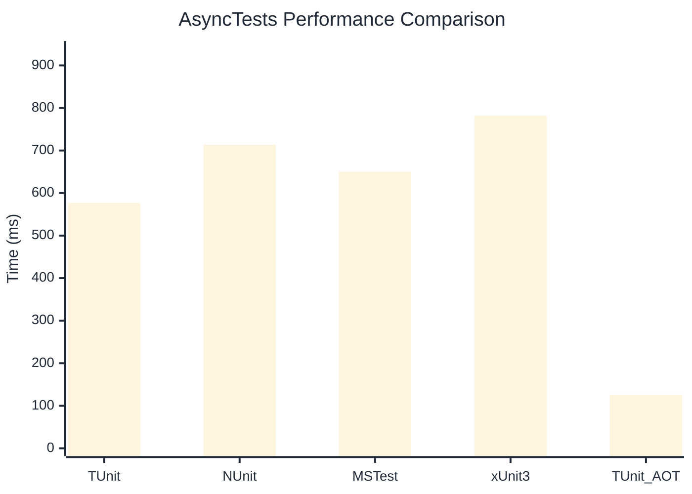

# AsyncTests Benchmark

:::info Last Updated
This benchmark was automatically generated on **2026-03-02** from the latest CI run.

**Environment:** Ubuntu Latest • .NET SDK 10.0.103
:::

## 📊 Results

| Framework | Version | Mean | Median | StdDev |
|-----------|---------|------|--------|--------|
| **TUnit** | 1.18.0 | 576.4 ms | 575.5 ms | 4.22 ms |
| NUnit | 4.5.0 | 713.7 ms | 712.8 ms | 4.49 ms |
| MSTest | 4.1.0 | 650.3 ms | 649.6 ms | 7.58 ms |
| xUnit3 | 3.2.2 | 782.0 ms | 782.2 ms | 6.47 ms |
| **TUnit (AOT)** | 1.18.0 | 125.2 ms | 125.2 ms | 0.15 ms |

## 📈 Visual Comparison

## 🎯 Key Insights

This benchmark compares TUnit's performance against NUnit, MSTest, xUnit3 using identical test scenarios.

---

:::note Methodology
View the [benchmarks overview](/docs/benchmarks) for methodology details and environment information.
:::

*Last generated: 2026-03-02T11:12:57.401Z*
