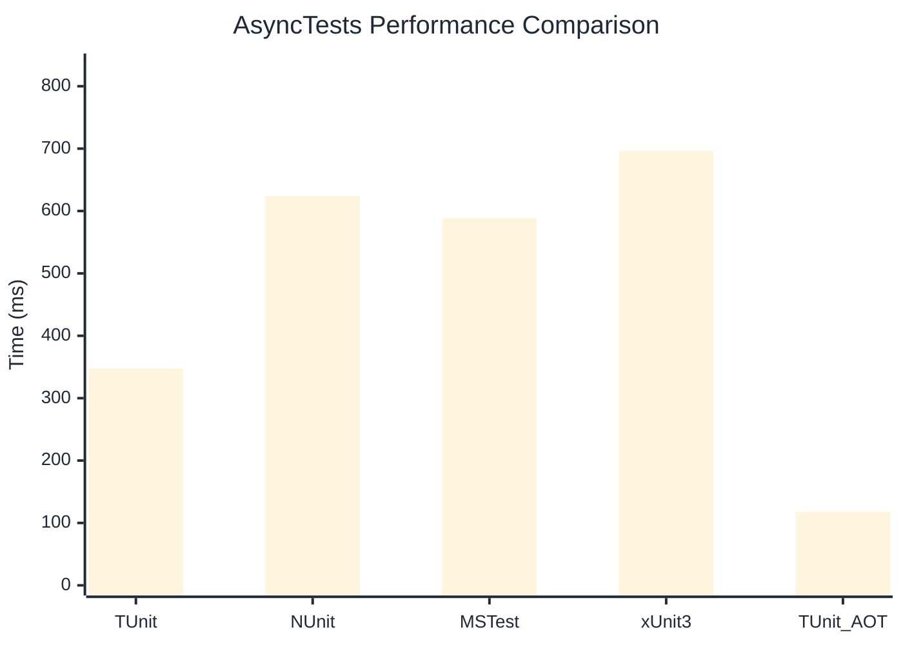

# AsyncTests Benchmark

> Realistic async/await patterns with I/O simulation

:::info Last Updated
This benchmark was automatically generated on **2026-05-31** from the latest CI run.

**Environment:** Ubuntu Latest • .NET SDK 10.0.300
:::

## 📊 Results

| Framework | Version | Mean | Median | StdDev |
|-----------|---------|------|--------|--------|
| **TUnit** | 1.47.0 | 347.7 ms | 347.2 ms | 8.10 ms |
| NUnit | 4.6.1 | 623.8 ms | 611.8 ms | 40.94 ms |
| MSTest | 4.2.3 | 588.5 ms | 587.3 ms | 31.40 ms |
| xUnit3 | 3.2.2 | 696.6 ms | 697.2 ms | 27.88 ms |
| **TUnit (AOT)** | 1.47.0 | 117.9 ms | 117.9 ms | 0.83 ms |

## 📈 Visual Comparison

```mermaid
%%{init: {
  'theme':'base',
  'themeVariables': {
    'primaryColor': '#2563eb',
    'primaryTextColor': '#1f2937',
    'primaryBorderColor': '#1e40af',
    'lineColor': '#6b7280',
    'secondaryColor': '#7c3aed',
    'tertiaryColor': '#dc2626',
    'background': '#ffffff',
    'mainBkg': '#2563eb',
    'secondBkg': '#7c3aed',
    'tertiaryBkg': '#dc2626',
    'clusterBkg': '#f3f4f6',
    'edgeLabelBackground': '#ffffff',
    'tertiaryTextColor': '#1f2937',
    'pie1': '#2563eb',
    'pie2': '#7c3aed',
    'pie3': '#dc2626',
    'pie4': '#f59e0b',
    'pie5': '#10b981',
    'pie6': '#06b6d4',
    'pie7': '#ec4899',
    'pie8': '#6366f1',
    'pie9': '#84cc16',
    'pie10': '#f97316',
    'pie11': '#14b8a6',
    'pie12': '#a855f7'
  }
}}%%
xychart-beta
  title "AsyncTests Performance Comparison"
  x-axis ["TUnit", "NUnit", "MSTest", "xUnit3", "TUnit_AOT"]
  y-axis "Time (ms)" 0 --> 836
  bar [347.7, 623.8, 588.5, 696.6, 117.9]
```

## 🎯 Key Insights

This benchmark compares TUnit's performance against NUnit, MSTest, xUnit3 using identical test scenarios.

---

:::note Methodology
View the [benchmarks overview](/docs/benchmarks) for methodology details and environment information.
:::

*Last generated: 2026-05-31T00:48:53.164Z*
