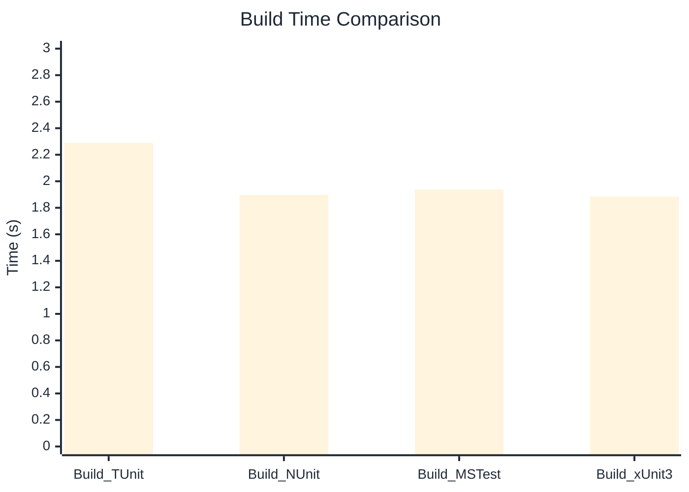

# Build Performance Benchmark

:::info Last Updated
This benchmark was automatically generated on **2026-03-02** from the latest CI run.

**Environment:** Ubuntu Latest • .NET SDK 10.0.103
:::

## 📊 Results

Compilation time comparison across frameworks:

| Framework | Version | Mean | Median | StdDev |
|-----------|---------|------|--------|--------|
| **TUnit** | 1.17.54 | 2.289 s | 2.289 s | 0.0215 s |
| Build_NUnit | 4.5.0 | 1.897 s | 1.907 s | 0.0321 s |
| Build_MSTest | 4.1.0 | 1.938 s | 1.939 s | 0.0188 s |
| Build_xUnit3 | 3.2.2 | 1.885 s | 1.879 s | 0.0417 s |

## 📈 Visual Comparison

---

:::note Methodology
View the [benchmarks overview](/docs/benchmarks) for methodology details and environment information.
:::

*Last generated: 2026-03-02T00:35:35.777Z*
