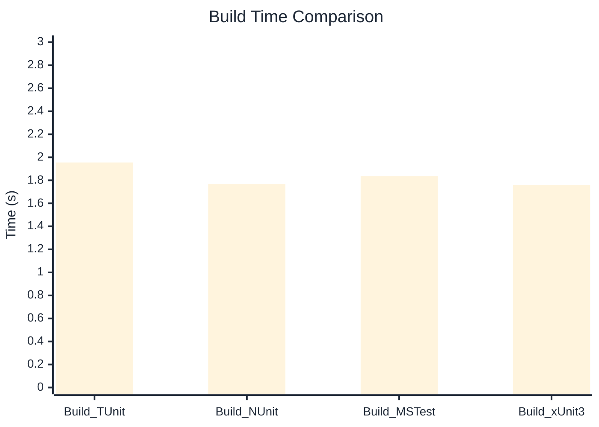

# Build Performance Benchmark

:::info Last Updated
This benchmark was automatically generated on **2026-05-01** from the latest CI run.

**Environment:** Ubuntu Latest • .NET SDK 10.0.203
:::

## 📊 Results

Compilation time comparison across frameworks:

| Framework | Version | Mean | Median | StdDev |
|-----------|---------|------|--------|--------|
| **TUnit** | 1.41.0 | 1.955 s | 1.949 s | 0.0354 s |
| Build_NUnit | 4.5.1 | 1.767 s | 1.767 s | 0.0179 s |
| Build_MSTest | 4.2.2 | 1.837 s | 1.831 s | 0.0278 s |
| Build_xUnit3 | 3.2.2 | 1.760 s | 1.756 s | 0.0177 s |

## 📈 Visual Comparison

```mermaid
%%{init: {
  'theme':'base',
  'themeVariables': {
    'primaryColor': '#2563eb',
    'primaryTextColor': '#1f2937',
    'primaryBorderColor': '#1e40af',
    'lineColor': '#6b7280',
    'secondaryColor': '#7c3aed',
    'tertiaryColor': '#dc2626',
    'background': '#ffffff',
    'mainBkg': '#2563eb',
    'secondBkg': '#7c3aed',
    'tertiaryBkg': '#dc2626',
    'clusterBkg': '#f3f4f6',
    'edgeLabelBackground': '#ffffff',
    'tertiaryTextColor': '#1f2937',
    'pie1': '#2563eb',
    'pie2': '#7c3aed',
    'pie3': '#dc2626',
    'pie4': '#f59e0b',
    'pie5': '#10b981',
    'pie6': '#06b6d4',
    'pie7': '#ec4899',
    'pie8': '#6366f1',
    'pie9': '#84cc16',
    'pie10': '#f97316',
    'pie11': '#14b8a6',
    'pie12': '#a855f7'
  }
}}%%
xychart-beta
  title "Build Time Comparison"
  x-axis ["Build_TUnit", "Build_NUnit", "Build_MSTest", "Build_xUnit3"]
  y-axis "Time (s)" 0 --> 3
  bar [1.955, 1.767, 1.837, 1.76]
```

---

:::note Methodology
View the [benchmarks overview](/docs/benchmarks) for methodology details and environment information.
:::

*Last generated: 2026-05-01T00:54:13.515Z*
