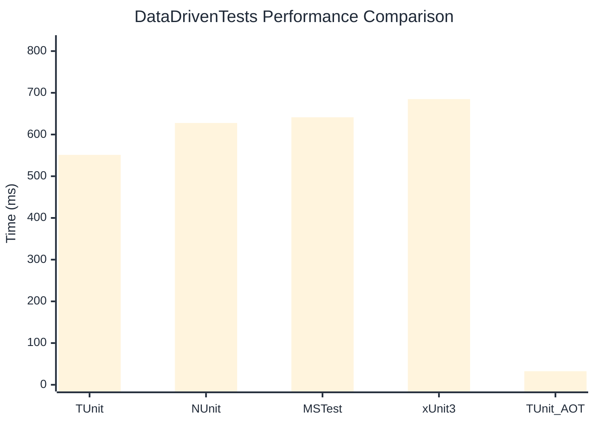

# DataDrivenTests Benchmark

:::info Last Updated
This benchmark was automatically generated on **2026-03-04** from the latest CI run.

**Environment:** Ubuntu Latest • .NET SDK 10.0.103
:::

## 📊 Results

| Framework | Version | Mean | Median | StdDev |
|-----------|---------|------|--------|--------|
| **TUnit** | 1.18.21 | 551.15 ms | 555.15 ms | 20.959 ms |
| NUnit | 4.5.0 | 627.68 ms | 629.04 ms | 11.090 ms |
| MSTest | 4.1.0 | 641.36 ms | 643.89 ms | 11.895 ms |
| xUnit3 | 3.2.2 | 684.94 ms | 683.37 ms | 11.422 ms |
| **TUnit (AOT)** | 1.18.21 | 32.54 ms | 32.75 ms | 1.143 ms |

## 📈 Visual Comparison

## 🎯 Key Insights

This benchmark compares TUnit's performance against NUnit, MSTest, xUnit3 using identical test scenarios.

---

:::note Methodology
View the [benchmarks overview](/docs/benchmarks) for methodology details and environment information.
:::

*Last generated: 2026-03-04T00:34:55.557Z*
