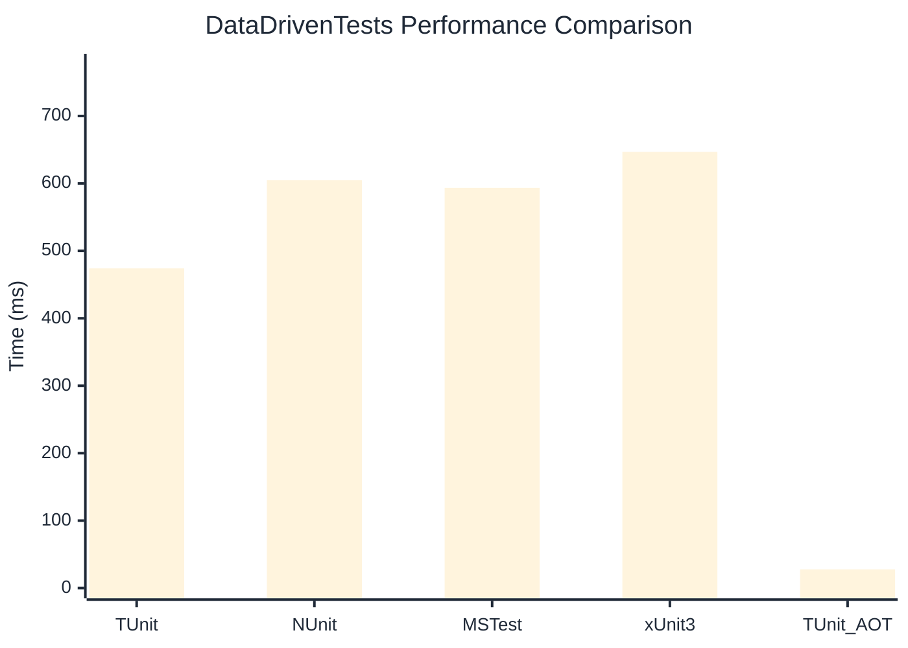

# DataDrivenTests Benchmark

:::info Last Updated
This benchmark was automatically generated on **2026-04-27** from the latest CI run.

**Environment:** Ubuntu Latest • .NET SDK 10.0.203
:::

## 📊 Results

| Framework | Version | Mean | Median | StdDev |
|-----------|---------|------|--------|--------|
| **TUnit** | 1.40.0 | 474.02 ms | 472.73 ms | 5.278 ms |
| NUnit | 4.5.1 | 604.71 ms | 602.58 ms | 7.517 ms |
| MSTest | 4.2.1 | 593.49 ms | 593.34 ms | 5.628 ms |
| xUnit3 | 3.2.2 | 646.83 ms | 646.44 ms | 5.530 ms |
| **TUnit (AOT)** | 1.40.0 | 27.77 ms | 27.75 ms | 1.896 ms |

## 📈 Visual Comparison

## 🎯 Key Insights

This benchmark compares TUnit's performance against NUnit, MSTest, xUnit3 using identical test scenarios.

---

:::note Methodology
View the [benchmarks overview](/docs/benchmarks) for methodology details and environment information.
:::

*Last generated: 2026-04-27T00:47:54.494Z*
