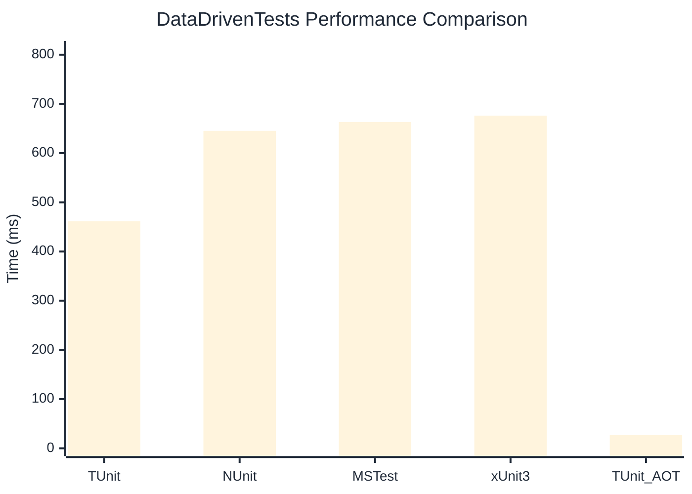

# DataDrivenTests Benchmark

:::info Last Updated
This benchmark was automatically generated on **2026-05-02** from the latest CI run.

**Environment:** Ubuntu Latest • .NET SDK 10.0.203
:::

## 📊 Results

| Framework | Version | Mean | Median | StdDev |
|-----------|---------|------|--------|--------|
| **TUnit** | 1.41.0 | 461.39 ms | 463.14 ms | 3.899 ms |
| NUnit | 4.5.1 | 645.36 ms | 645.28 ms | 8.777 ms |
| MSTest | 4.2.2 | 663.37 ms | 664.17 ms | 8.646 ms |
| xUnit3 | 3.2.2 | 676.12 ms | 671.35 ms | 20.441 ms |
| **TUnit (AOT)** | 1.41.0 | 26.63 ms | 26.49 ms | 2.016 ms |

## 📈 Visual Comparison

## 🎯 Key Insights

This benchmark compares TUnit's performance against NUnit, MSTest, xUnit3 using identical test scenarios.

---

:::note Methodology
View the [benchmarks overview](/docs/benchmarks) for methodology details and environment information.
:::

*Last generated: 2026-05-02T00:49:50.553Z*
