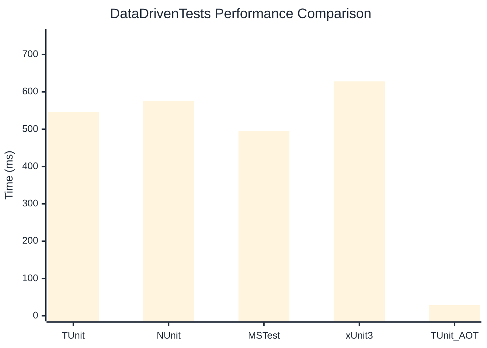

# DataDrivenTests Benchmark

:::info Last Updated
This benchmark was automatically generated on **2026-03-07** from the latest CI run.

**Environment:** Ubuntu Latest • .NET SDK 10.0.103
:::

## 📊 Results

| Framework | Version | Mean | Median | StdDev |
|-----------|---------|------|--------|--------|
| **TUnit** | 1.19.0 | 546.06 ms | 546.74 ms | 9.201 ms |
| NUnit | 4.5.1 | 575.99 ms | 575.20 ms | 6.283 ms |
| MSTest | 4.1.0 | 495.41 ms | 495.96 ms | 6.635 ms |
| xUnit3 | 3.2.2 | 628.10 ms | 627.33 ms | 8.848 ms |
| **TUnit (AOT)** | 1.19.0 | 28.71 ms | 28.72 ms | 0.280 ms |

## 📈 Visual Comparison

## 🎯 Key Insights

This benchmark compares TUnit's performance against NUnit, MSTest, xUnit3 using identical test scenarios.

---

:::note Methodology
View the [benchmarks overview](/docs/benchmarks) for methodology details and environment information.
:::

*Last generated: 2026-03-07T00:35:10.912Z*
