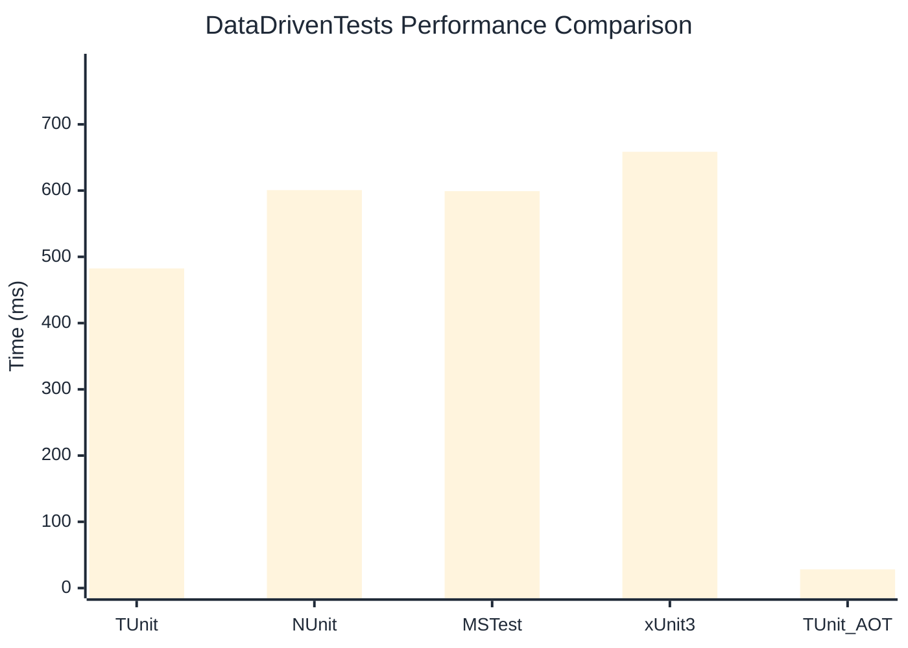

# DataDrivenTests Benchmark

:::info Last Updated
This benchmark was automatically generated on **2026-05-20** from the latest CI run.

**Environment:** Ubuntu Latest • .NET SDK 10.0.300
:::

## 📊 Results

| Framework | Version | Mean | Median | StdDev |
|-----------|---------|------|--------|--------|
| **TUnit** | 1.45.8 | 482.46 ms | 483.57 ms | 5.561 ms |
| NUnit | 4.6.1 | 600.70 ms | 601.00 ms | 7.909 ms |
| MSTest | 4.2.3 | 599.21 ms | 599.99 ms | 9.339 ms |
| xUnit3 | 3.2.2 | 658.53 ms | 658.17 ms | 8.780 ms |
| **TUnit (AOT)** | 1.45.8 | 28.32 ms | 28.06 ms | 2.173 ms |

## 📈 Visual Comparison

## 🎯 Key Insights

This benchmark compares TUnit's performance against NUnit, MSTest, xUnit3 using identical test scenarios.

---

:::note Methodology
View the [benchmarks overview](/docs/benchmarks) for methodology details and environment information.
:::

*Last generated: 2026-05-20T00:59:08.754Z*
