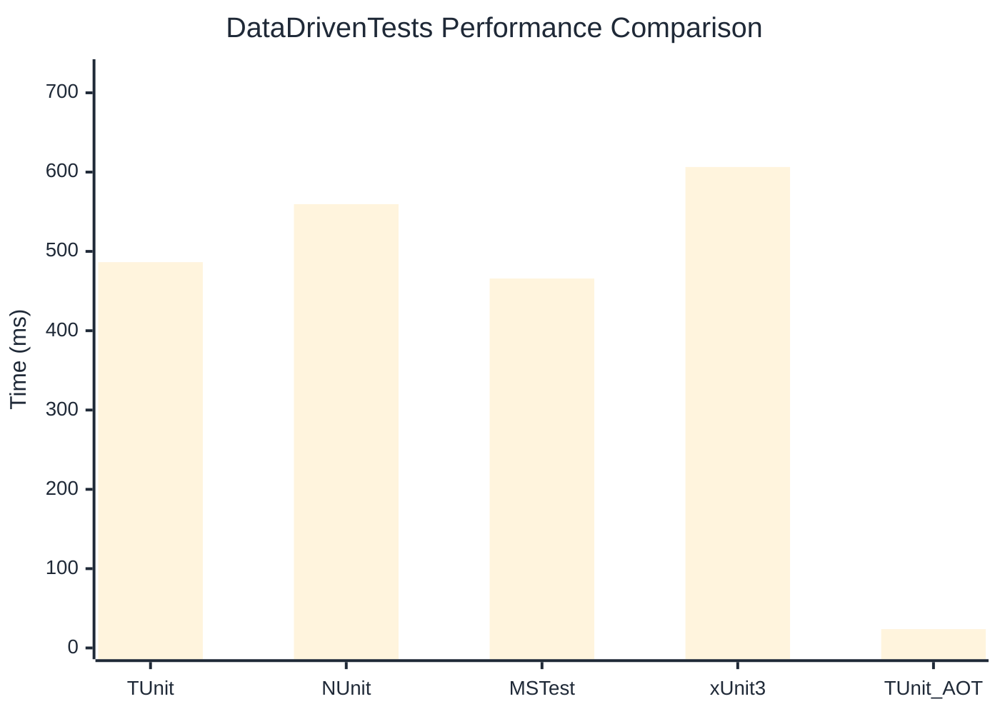

# DataDrivenTests Benchmark

:::info Last Updated
This benchmark was automatically generated on **2026-03-27** from the latest CI run.

**Environment:** Ubuntu Latest • .NET SDK 10.0.201
:::

## 📊 Results

| Framework | Version | Mean | Median | StdDev |
|-----------|---------|------|--------|--------|
| **TUnit** | 1.21.30 | 486.46 ms | 489.55 ms | 8.026 ms |
| NUnit | 4.5.1 | 559.57 ms | 558.16 ms | 6.294 ms |
| MSTest | 4.1.0 | 465.79 ms | 466.52 ms | 4.447 ms |
| xUnit3 | 3.2.2 | 606.42 ms | 607.41 ms | 10.412 ms |
| **TUnit (AOT)** | 1.21.30 | 23.75 ms | 23.79 ms | 0.539 ms |

## 📈 Visual Comparison

## 🎯 Key Insights

This benchmark compares TUnit's performance against NUnit, MSTest, xUnit3 using identical test scenarios.

---

:::note Methodology
View the [benchmarks overview](/docs/benchmarks) for methodology details and environment information.
:::

*Last generated: 2026-03-27T00:40:33.507Z*
