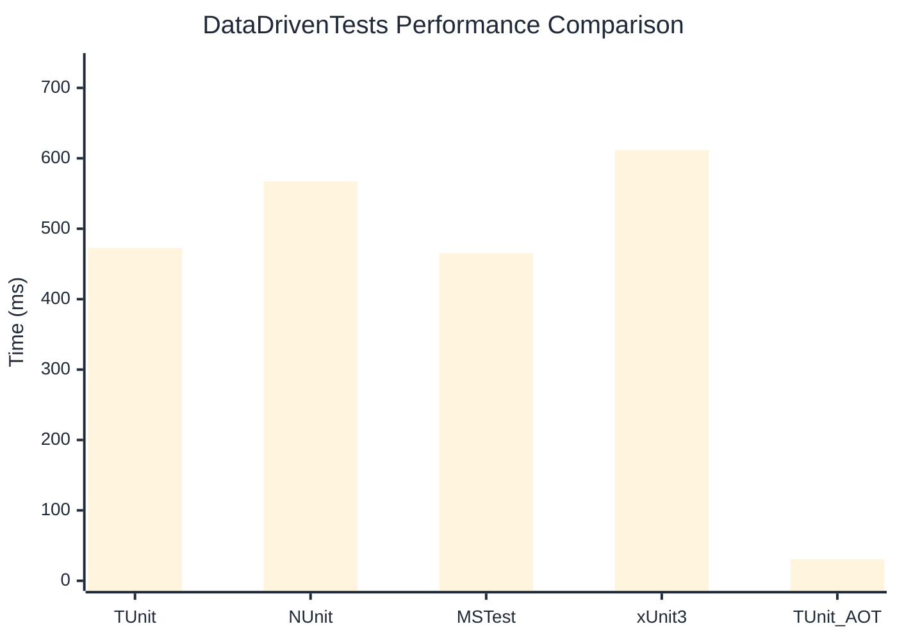

# DataDrivenTests Benchmark

:::info Last Updated
This benchmark was automatically generated on **2026-05-27** from the latest CI run.

**Environment:** Ubuntu Latest • .NET SDK 10.0.300
:::

## 📊 Results

| Framework | Version | Mean | Median | StdDev |
|-----------|---------|------|--------|--------|
| **TUnit** | 1.45.29 | 472.69 ms | 472.92 ms | 7.300 ms |
| NUnit | 4.6.1 | 567.28 ms | 565.56 ms | 6.618 ms |
| MSTest | 4.2.3 | 465.59 ms | 465.29 ms | 4.327 ms |
| xUnit3 | 3.2.2 | 611.81 ms | 611.98 ms | 9.974 ms |
| **TUnit (AOT)** | 1.45.29 | 30.90 ms | 30.83 ms | 2.132 ms |

## 📈 Visual Comparison

## 🎯 Key Insights

This benchmark compares TUnit's performance against NUnit, MSTest, xUnit3 using identical test scenarios.

---

:::note Methodology
View the [benchmarks overview](/docs/benchmarks) for methodology details and environment information.
:::

*Last generated: 2026-05-27T00:58:02.779Z*
