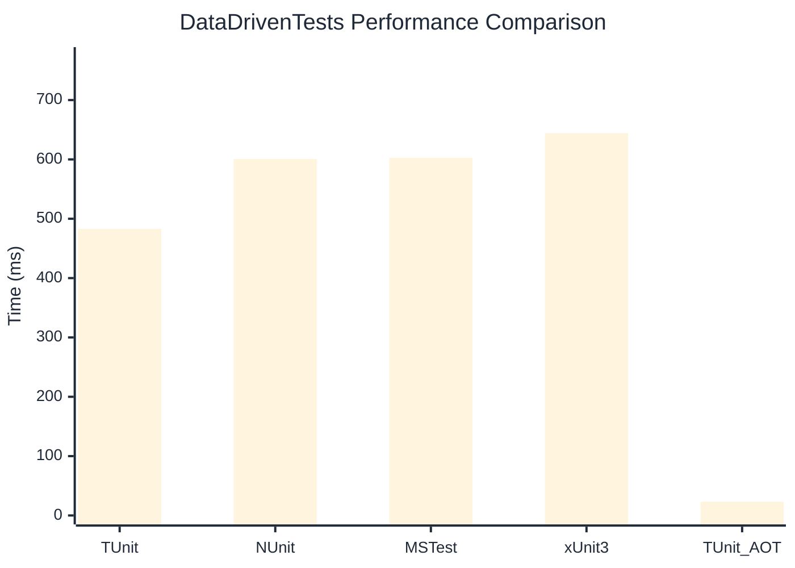

# DataDrivenTests Benchmark

:::info Last Updated
This benchmark was automatically generated on **2026-04-01** from the latest CI run.

**Environment:** Ubuntu Latest • .NET SDK 10.0.201
:::

## 📊 Results

| Framework | Version | Mean | Median | StdDev |
|-----------|---------|------|--------|--------|
| **TUnit** | 1.24.13 | 483.01 ms | 482.58 ms | 4.429 ms |
| NUnit | 4.5.1 | 600.82 ms | 595.16 ms | 9.770 ms |
| MSTest | 4.1.0 | 602.58 ms | 603.30 ms | 7.271 ms |
| xUnit3 | 3.2.2 | 644.22 ms | 643.94 ms | 5.683 ms |
| **TUnit (AOT)** | 1.24.13 | 23.11 ms | 23.09 ms | 0.260 ms |

## 📈 Visual Comparison

## 🎯 Key Insights

This benchmark compares TUnit's performance against NUnit, MSTest, xUnit3 using identical test scenarios.

---

:::note Methodology
View the [benchmarks overview](/docs/benchmarks) for methodology details and environment information.
:::

*Last generated: 2026-04-01T00:43:53.533Z*
