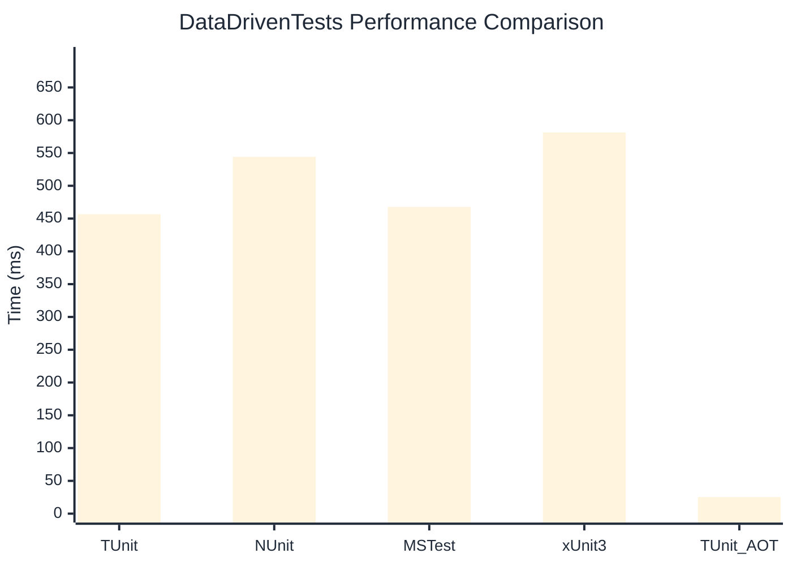

# DataDrivenTests Benchmark

:::info Last Updated
This benchmark was automatically generated on **2026-04-21** from the latest CI run.

**Environment:** Ubuntu Latest • .NET SDK 10.0.202
:::

## 📊 Results

| Framework | Version | Mean | Median | StdDev |
|-----------|---------|------|--------|--------|
| **TUnit** | 1.37.10 | 456.68 ms | 456.21 ms | 2.175 ms |
| NUnit | 4.5.1 | 544.17 ms | 542.71 ms | 5.797 ms |
| MSTest | 4.2.1 | 467.75 ms | 464.91 ms | 12.751 ms |
| xUnit3 | 3.2.2 | 581.30 ms | 579.55 ms | 6.612 ms |
| **TUnit (AOT)** | 1.37.10 | 25.31 ms | 25.30 ms | 1.142 ms |

## 📈 Visual Comparison

## 🎯 Key Insights

This benchmark compares TUnit's performance against NUnit, MSTest, xUnit3 using identical test scenarios.

---

:::note Methodology
View the [benchmarks overview](/docs/benchmarks) for methodology details and environment information.
:::

*Last generated: 2026-04-21T00:46:15.218Z*
