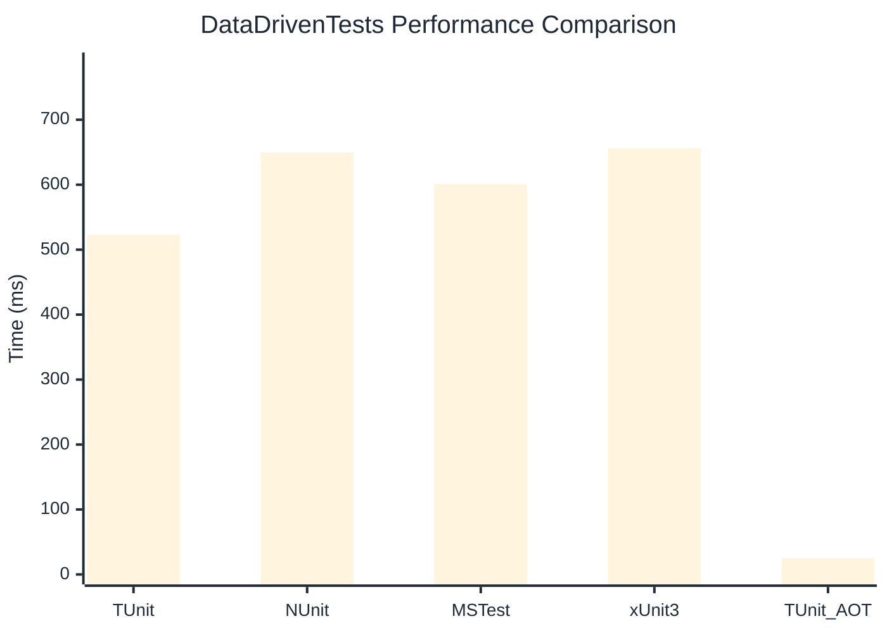

# DataDrivenTests Benchmark

:::info Last Updated
This benchmark was automatically generated on **2026-04-13** from the latest CI run.

**Environment:** Ubuntu Latest • .NET SDK 10.0.201
:::

## 📊 Results

| Framework | Version | Mean | Median | StdDev |
|-----------|---------|------|--------|--------|
| **TUnit** | 1.33.0 | 522.88 ms | 521.41 ms | 13.805 ms |
| NUnit | 4.5.1 | 649.50 ms | 649.20 ms | 14.731 ms |
| MSTest | 4.2.1 | 600.97 ms | 602.55 ms | 8.061 ms |
| xUnit3 | 3.2.2 | 656.10 ms | 653.38 ms | 10.326 ms |
| **TUnit (AOT)** | 1.33.0 | 24.89 ms | 24.76 ms | 0.655 ms |

## 📈 Visual Comparison

## 🎯 Key Insights

This benchmark compares TUnit's performance against NUnit, MSTest, xUnit3 using identical test scenarios.

---

:::note Methodology
View the [benchmarks overview](/docs/benchmarks) for methodology details and environment information.
:::

*Last generated: 2026-04-13T00:44:38.472Z*
