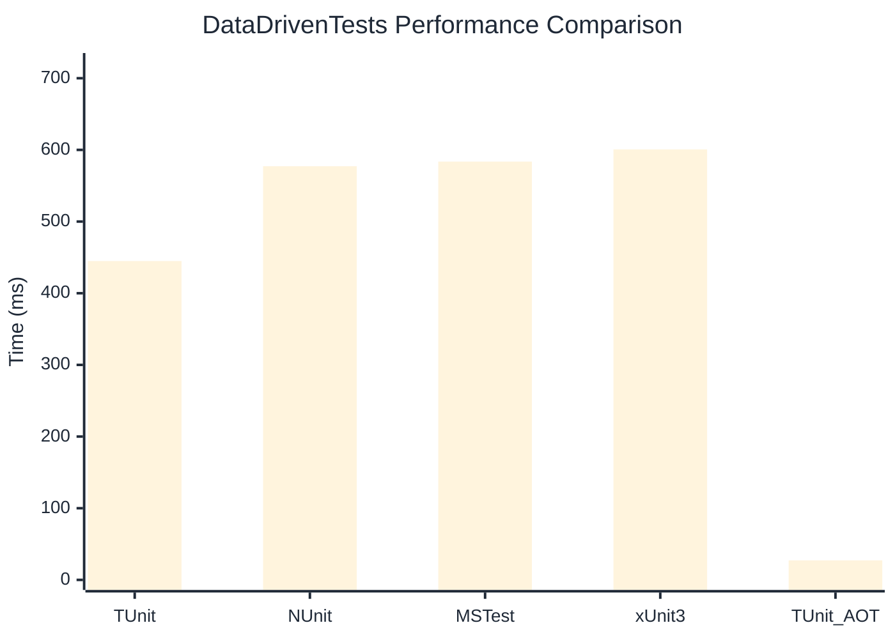

# DataDrivenTests Benchmark

:::info Last Updated
This benchmark was automatically generated on **2026-05-29** from the latest CI run.

**Environment:** Ubuntu Latest • .NET SDK 10.0.300
:::

## 📊 Results

| Framework | Version | Mean | Median | StdDev |
|-----------|---------|------|--------|--------|
| **TUnit** | 1.47.0 | 444.93 ms | 444.59 ms | 5.320 ms |
| NUnit | 4.6.1 | 577.19 ms | 575.61 ms | 8.070 ms |
| MSTest | 4.2.3 | 583.71 ms | 584.49 ms | 7.309 ms |
| xUnit3 | 3.2.2 | 600.69 ms | 603.72 ms | 6.826 ms |
| **TUnit (AOT)** | 1.47.0 | 27.22 ms | 27.24 ms | 1.697 ms |

## 📈 Visual Comparison

## 🎯 Key Insights

This benchmark compares TUnit's performance against NUnit, MSTest, xUnit3 using identical test scenarios.

---

:::note Methodology
View the [benchmarks overview](/docs/benchmarks) for methodology details and environment information.
:::

*Last generated: 2026-05-29T00:36:57.173Z*
