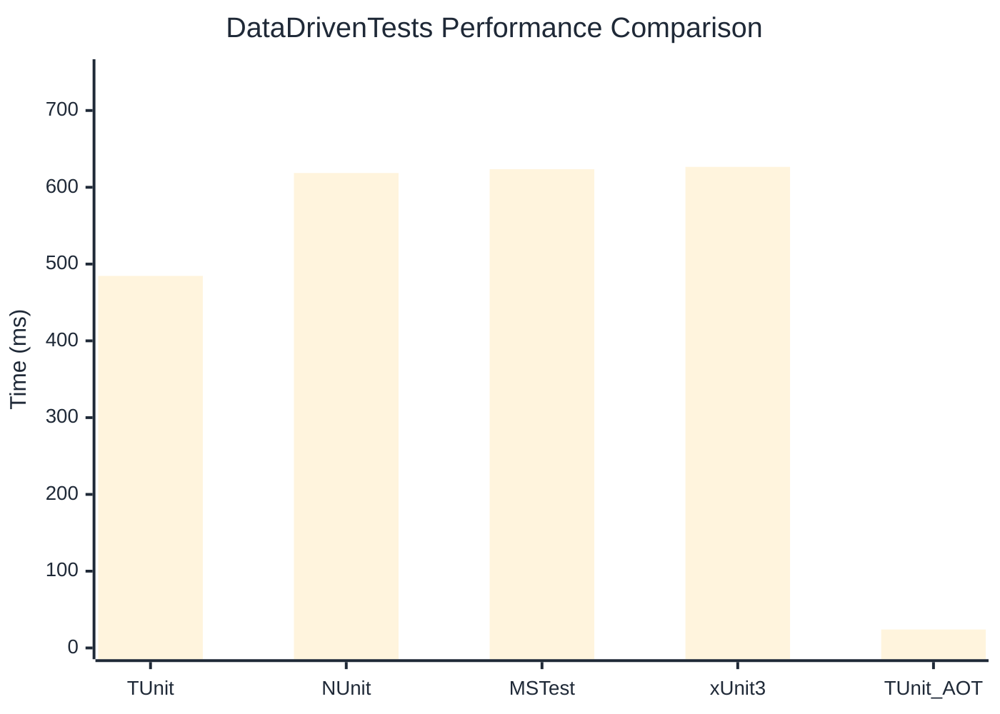

# DataDrivenTests Benchmark

:::info Last Updated
This benchmark was automatically generated on **2026-03-09** from the latest CI run.

**Environment:** Ubuntu Latest • .NET SDK 10.0.103
:::

## 📊 Results

| Framework | Version | Mean | Median | StdDev |
|-----------|---------|------|--------|--------|
| **TUnit** | 1.19.11 | 484.57 ms | 484.30 ms | 6.148 ms |
| NUnit | 4.5.1 | 618.61 ms | 618.93 ms | 8.348 ms |
| MSTest | 4.1.0 | 623.60 ms | 625.44 ms | 9.572 ms |
| xUnit3 | 3.2.2 | 626.58 ms | 627.02 ms | 7.323 ms |
| **TUnit (AOT)** | 1.19.11 | 24.07 ms | 24.04 ms | 0.211 ms |

## 📈 Visual Comparison

## 🎯 Key Insights

This benchmark compares TUnit's performance against NUnit, MSTest, xUnit3 using identical test scenarios.

---

:::note Methodology
View the [benchmarks overview](/docs/benchmarks) for methodology details and environment information.
:::

*Last generated: 2026-03-09T00:36:33.795Z*
