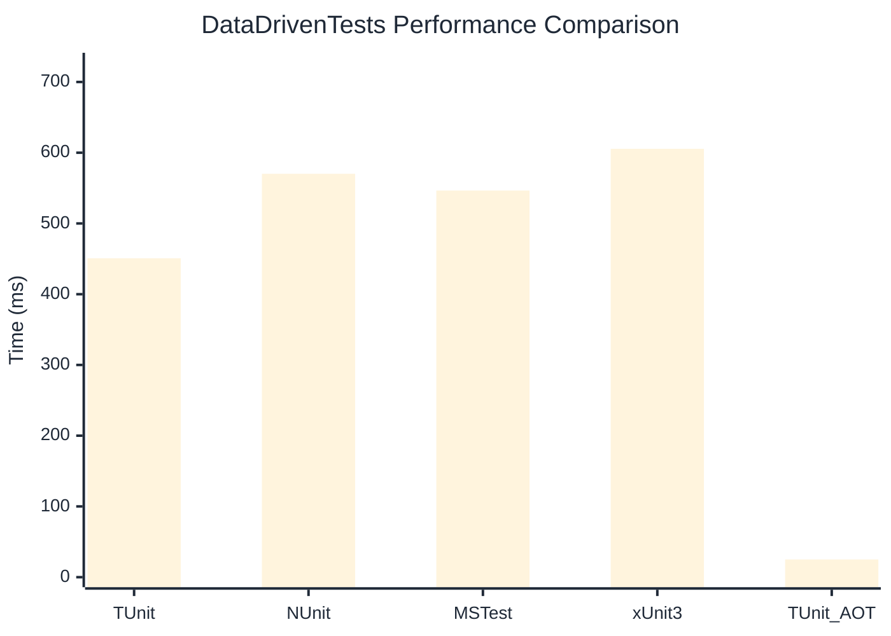

# DataDrivenTests Benchmark

:::info Last Updated
This benchmark was automatically generated on **2026-05-16** from the latest CI run.

**Environment:** Ubuntu Latest • .NET SDK 10.0.300
:::

## 📊 Results

| Framework | Version | Mean | Median | StdDev |
|-----------|---------|------|--------|--------|
| **TUnit** | 1.44.39 | 450.75 ms | 451.19 ms | 1.711 ms |
| NUnit | 4.6.0 | 570.18 ms | 567.31 ms | 9.321 ms |
| MSTest | 4.2.3 | 546.53 ms | 542.22 ms | 17.726 ms |
| xUnit3 | 3.2.2 | 605.54 ms | 603.20 ms | 6.579 ms |
| **TUnit (AOT)** | 1.44.39 | 25.05 ms | 25.11 ms | 1.476 ms |

## 📈 Visual Comparison

## 🎯 Key Insights

This benchmark compares TUnit's performance against NUnit, MSTest, xUnit3 using identical test scenarios.

---

:::note Methodology
View the [benchmarks overview](/docs/benchmarks) for methodology details and environment information.
:::

*Last generated: 2026-05-16T00:50:45.397Z*
