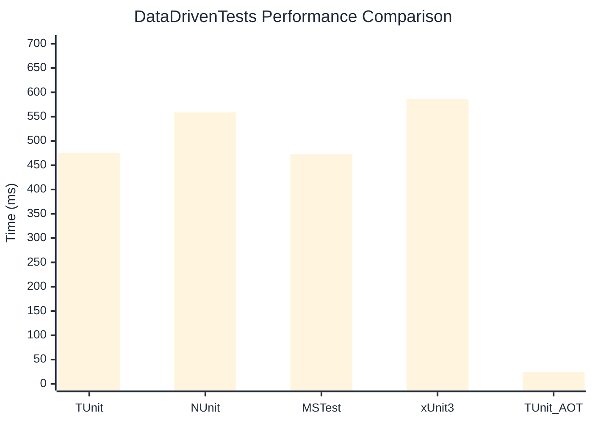

# DataDrivenTests Benchmark

:::info Last Updated
This benchmark was automatically generated on **2026-03-30** from the latest CI run.

**Environment:** Ubuntu Latest • .NET SDK 10.0.201
:::

## 📊 Results

| Framework | Version | Mean | Median | StdDev |
|-----------|---------|------|--------|--------|
| **TUnit** | 1.22.19 | 474.87 ms | 474.93 ms | 3.082 ms |
| NUnit | 4.5.1 | 558.78 ms | 558.04 ms | 9.222 ms |
| MSTest | 4.1.0 | 472.66 ms | 470.43 ms | 7.689 ms |
| xUnit3 | 3.2.2 | 586.55 ms | 586.01 ms | 6.616 ms |
| **TUnit (AOT)** | 1.22.19 | 23.81 ms | 23.60 ms | 0.441 ms |

## 📈 Visual Comparison

## 🎯 Key Insights

This benchmark compares TUnit's performance against NUnit, MSTest, xUnit3 using identical test scenarios.

---

:::note Methodology
View the [benchmarks overview](/docs/benchmarks) for methodology details and environment information.
:::

*Last generated: 2026-03-30T00:43:24.090Z*
