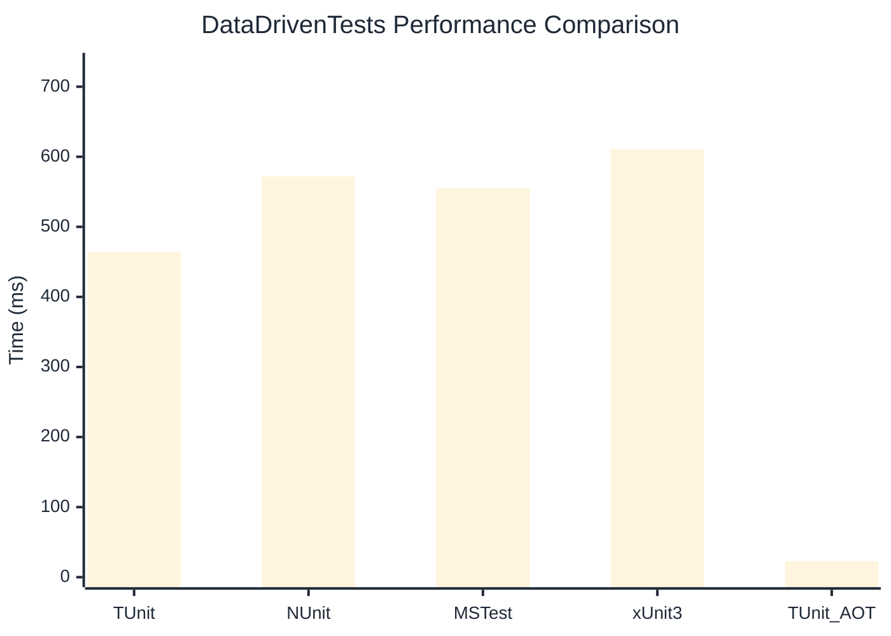

# DataDrivenTests Benchmark

:::info Last Updated
This benchmark was automatically generated on **2026-04-10** from the latest CI run.

**Environment:** Ubuntu Latest • .NET SDK 10.0.201
:::

## 📊 Results

| Framework | Version | Mean | Median | StdDev |
|-----------|---------|------|--------|--------|
| **TUnit** | 1.30.8 | 463.92 ms | 463.70 ms | 3.076 ms |
| NUnit | 4.5.1 | 571.74 ms | 569.35 ms | 7.535 ms |
| MSTest | 4.2.1 | 554.68 ms | 554.43 ms | 16.543 ms |
| xUnit3 | 3.2.2 | 611.12 ms | 609.72 ms | 5.375 ms |
| **TUnit (AOT)** | 1.30.8 | 22.82 ms | 22.75 ms | 0.740 ms |

## 📈 Visual Comparison

## 🎯 Key Insights

This benchmark compares TUnit's performance against NUnit, MSTest, xUnit3 using identical test scenarios.

---

:::note Methodology
View the [benchmarks overview](/docs/benchmarks) for methodology details and environment information.
:::

*Last generated: 2026-04-10T00:41:03.221Z*
