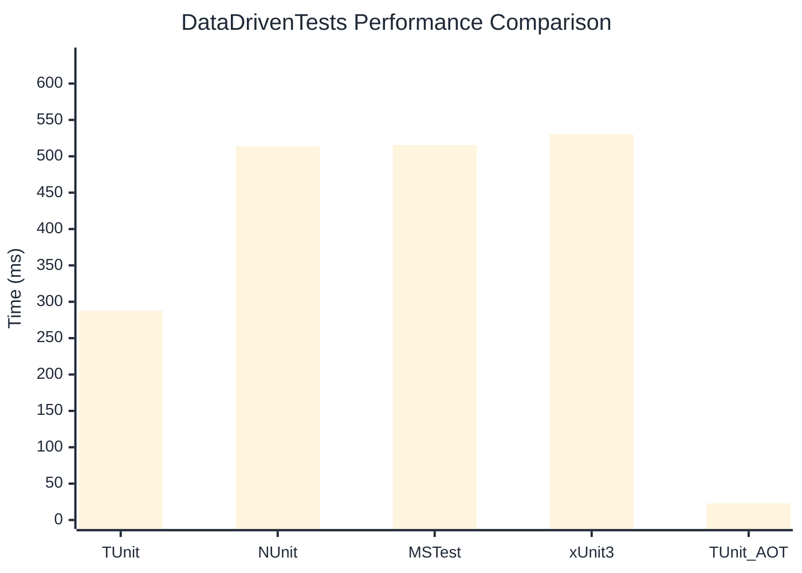

# DataDrivenTests Benchmark

:::info Last Updated
This benchmark was automatically generated on **2026-05-28** from the latest CI run.

**Environment:** Ubuntu Latest • .NET SDK 10.0.300
:::

## 📊 Results

| Framework | Version | Mean | Median | StdDev |
|-----------|---------|------|--------|--------|
| **TUnit** | 1.45.29 | 287.75 ms | 286.92 ms | 13.198 ms |
| NUnit | 4.6.1 | 513.77 ms | 512.93 ms | 8.789 ms |
| MSTest | 4.2.3 | 515.54 ms | 515.72 ms | 9.502 ms |
| xUnit3 | 3.2.2 | 530.26 ms | 531.10 ms | 10.609 ms |
| **TUnit (AOT)** | 1.45.29 | 22.78 ms | 22.94 ms | 2.077 ms |

## 📈 Visual Comparison

## 🎯 Key Insights

This benchmark compares TUnit's performance against NUnit, MSTest, xUnit3 using identical test scenarios.

---

:::note Methodology
View the [benchmarks overview](/docs/benchmarks) for methodology details and environment information.
:::

*Last generated: 2026-05-28T00:54:06.153Z*
