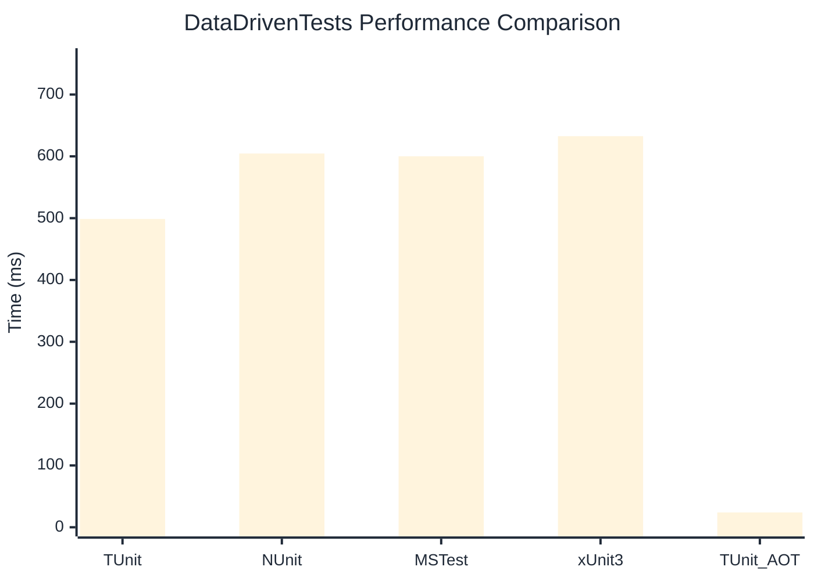

# DataDrivenTests Benchmark

:::info Last Updated
This benchmark was automatically generated on **2026-03-29** from the latest CI run.

**Environment:** Ubuntu Latest • .NET SDK 10.0.201
:::

## 📊 Results

| Framework | Version | Mean | Median | StdDev |
|-----------|---------|------|--------|--------|
| **TUnit** | 1.22.6 | 498.76 ms | 498.67 ms | 3.549 ms |
| NUnit | 4.5.1 | 604.56 ms | 602.71 ms | 16.403 ms |
| MSTest | 4.1.0 | 600.08 ms | 600.37 ms | 6.467 ms |
| xUnit3 | 3.2.2 | 632.64 ms | 631.19 ms | 8.078 ms |
| **TUnit (AOT)** | 1.22.6 | 23.94 ms | 23.72 ms | 0.558 ms |

## 📈 Visual Comparison

## 🎯 Key Insights

This benchmark compares TUnit's performance against NUnit, MSTest, xUnit3 using identical test scenarios.

---

:::note Methodology
View the [benchmarks overview](/docs/benchmarks) for methodology details and environment information.
:::

*Last generated: 2026-03-29T00:41:38.478Z*
