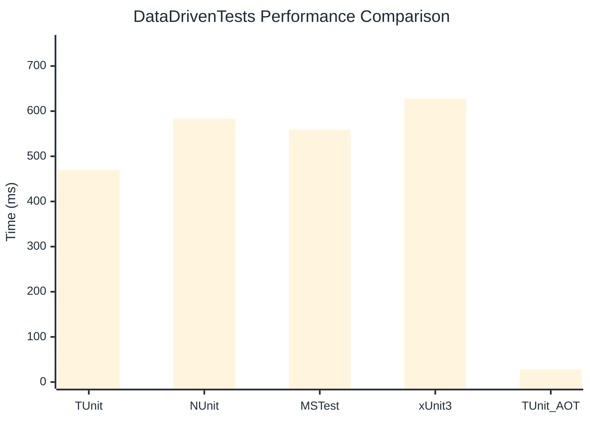

# DataDrivenTests Benchmark

:::info Last Updated
This benchmark was automatically generated on **2026-05-11** from the latest CI run.

**Environment:** Ubuntu Latest • .NET SDK 10.0.203
:::

## 📊 Results

| Framework | Version | Mean | Median | StdDev |
|-----------|---------|------|--------|--------|
| **TUnit** | 1.44.0 | 469.79 ms | 469.51 ms | 4.000 ms |
| NUnit | 4.6.0 | 583.68 ms | 584.23 ms | 8.494 ms |
| MSTest | 4.2.2 | 558.84 ms | 556.71 ms | 16.337 ms |
| xUnit3 | 3.2.2 | 627.69 ms | 629.33 ms | 7.973 ms |
| **TUnit (AOT)** | 1.44.0 | 27.89 ms | 27.88 ms | 1.877 ms |

## 📈 Visual Comparison

## 🎯 Key Insights

This benchmark compares TUnit's performance against NUnit, MSTest, xUnit3 using identical test scenarios.

---

:::note Methodology
View the [benchmarks overview](/docs/benchmarks) for methodology details and environment information.
:::

*Last generated: 2026-05-11T00:54:14.875Z*
