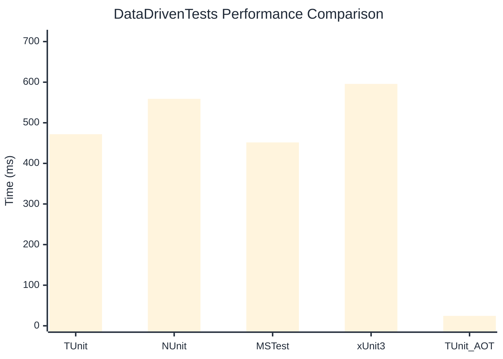

# DataDrivenTests Benchmark

:::info Last Updated
This benchmark was automatically generated on **2026-04-11** from the latest CI run.

**Environment:** Ubuntu Latest • .NET SDK 10.0.201
:::

## 📊 Results

| Framework | Version | Mean | Median | StdDev |
|-----------|---------|------|--------|--------|
| **TUnit** | 1.30.8 | 471.88 ms | 471.44 ms | 2.764 ms |
| NUnit | 4.5.1 | 558.97 ms | 560.76 ms | 10.161 ms |
| MSTest | 4.2.1 | 451.65 ms | 452.65 ms | 4.002 ms |
| xUnit3 | 3.2.2 | 595.75 ms | 593.82 ms | 10.860 ms |
| **TUnit (AOT)** | 1.30.8 | 24.45 ms | 24.41 ms | 0.504 ms |

## 📈 Visual Comparison

## 🎯 Key Insights

This benchmark compares TUnit's performance against NUnit, MSTest, xUnit3 using identical test scenarios.

---

:::note Methodology
View the [benchmarks overview](/docs/benchmarks) for methodology details and environment information.
:::

*Last generated: 2026-04-11T00:39:04.271Z*
