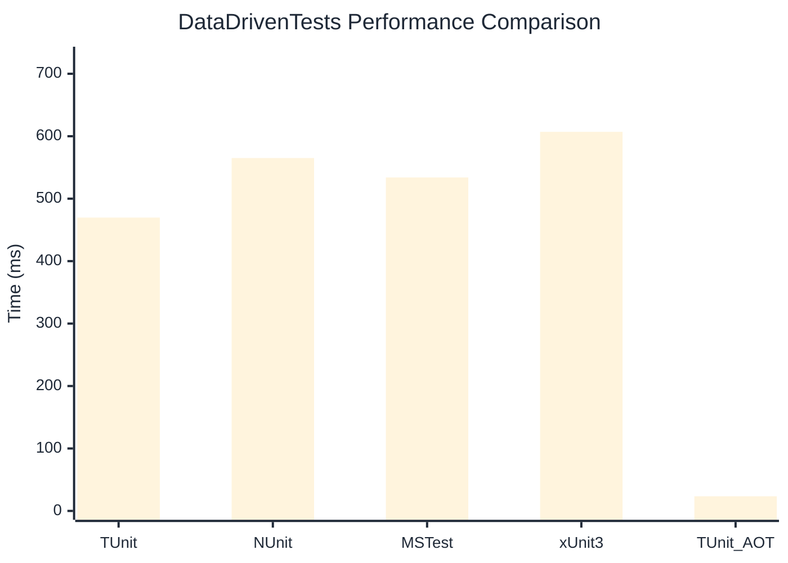

# DataDrivenTests Benchmark

:::info Last Updated
This benchmark was automatically generated on **2026-04-05** from the latest CI run.

**Environment:** Ubuntu Latest • .NET SDK 10.0.201
:::

## 📊 Results

| Framework | Version | Mean | Median | StdDev |
|-----------|---------|------|--------|--------|
| **TUnit** | 1.28.0 | 469.70 ms | 467.78 ms | 5.628 ms |
| NUnit | 4.5.1 | 565.08 ms | 565.43 ms | 5.414 ms |
| MSTest | 4.1.0 | 533.97 ms | 534.35 ms | 7.510 ms |
| xUnit3 | 3.2.2 | 607.03 ms | 604.60 ms | 6.753 ms |
| **TUnit (AOT)** | 1.28.0 | 23.48 ms | 23.37 ms | 0.751 ms |

## 📈 Visual Comparison

## 🎯 Key Insights

This benchmark compares TUnit's performance against NUnit, MSTest, xUnit3 using identical test scenarios.

---

:::note Methodology
View the [benchmarks overview](/docs/benchmarks) for methodology details and environment information.
:::

*Last generated: 2026-04-05T12:17:42.433Z*
