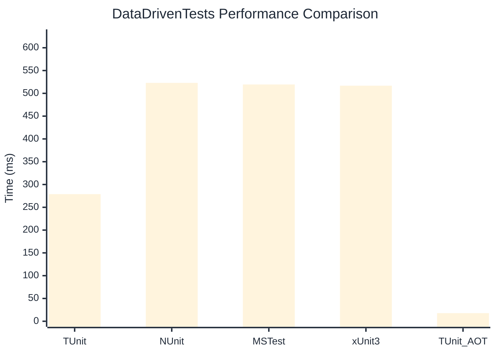

# DataDrivenTests Benchmark

:::info Last Updated
This benchmark was automatically generated on **2026-05-29** from the latest CI run.

**Environment:** Ubuntu Latest • .NET SDK 10.0.300
:::

## 📊 Results

| Framework | Version | Mean | Median | StdDev |
|-----------|---------|------|--------|--------|
| **TUnit** | 1.47.0 | 278.88 ms | 277.84 ms | 4.237 ms |
| NUnit | 4.6.1 | 522.96 ms | 525.51 ms | 12.895 ms |
| MSTest | 4.2.3 | 519.49 ms | 516.96 ms | 7.630 ms |
| xUnit3 | 3.2.2 | 516.82 ms | 515.29 ms | 6.450 ms |
| **TUnit (AOT)** | 1.47.0 | 17.85 ms | 17.77 ms | 1.281 ms |

## 📈 Visual Comparison

## 🎯 Key Insights

This benchmark compares TUnit's performance against NUnit, MSTest, xUnit3 using identical test scenarios.

---

:::note Methodology
View the [benchmarks overview](/docs/benchmarks) for methodology details and environment information.
:::

*Last generated: 2026-05-29T01:24:43.987Z*
