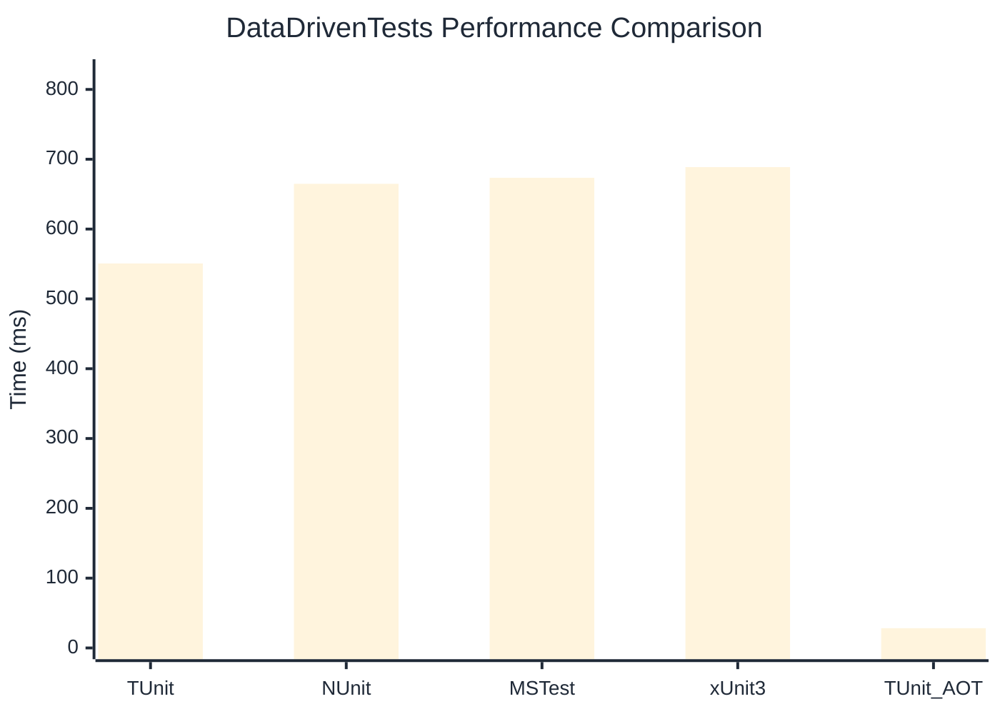

# DataDrivenTests Benchmark

:::info Last Updated
This benchmark was automatically generated on **2026-03-03** from the latest CI run.

**Environment:** Ubuntu Latest • .NET SDK 10.0.103
:::

## 📊 Results

| Framework | Version | Mean | Median | StdDev |
|-----------|---------|------|--------|--------|
| **TUnit** | 1.18.0 | 550.75 ms | 551.98 ms | 6.989 ms |
| NUnit | 4.5.0 | 664.82 ms | 662.82 ms | 12.007 ms |
| MSTest | 4.1.0 | 673.45 ms | 670.94 ms | 6.511 ms |
| xUnit3 | 3.2.2 | 688.72 ms | 689.67 ms | 10.340 ms |
| **TUnit (AOT)** | 1.18.0 | 28.30 ms | 28.35 ms | 0.411 ms |

## 📈 Visual Comparison

## 🎯 Key Insights

This benchmark compares TUnit's performance against NUnit, MSTest, xUnit3 using identical test scenarios.

---

:::note Methodology
View the [benchmarks overview](/docs/benchmarks) for methodology details and environment information.
:::

*Last generated: 2026-03-03T00:37:44.284Z*
