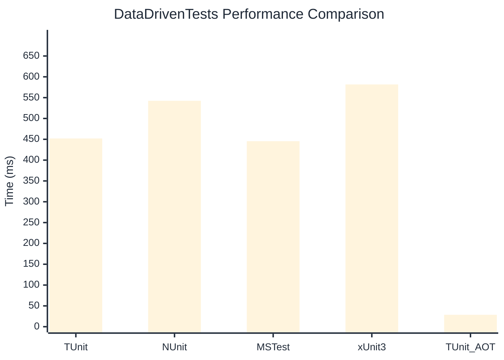

# DataDrivenTests Benchmark

:::info Last Updated
This benchmark was automatically generated on **2026-05-14** from the latest CI run.

**Environment:** Ubuntu Latest • .NET SDK 10.0.300
:::

## 📊 Results

| Framework | Version | Mean | Median | StdDev |
|-----------|---------|------|--------|--------|
| **TUnit** | 1.44.0 | 452.01 ms | 451.63 ms | 2.364 ms |
| NUnit | 4.6.0 | 542.47 ms | 542.63 ms | 5.098 ms |
| MSTest | 4.2.2 | 445.47 ms | 445.85 ms | 4.943 ms |
| xUnit3 | 3.2.2 | 581.69 ms | 583.26 ms | 5.481 ms |
| **TUnit (AOT)** | 1.44.0 | 28.63 ms | 28.29 ms | 2.663 ms |

## 📈 Visual Comparison

## 🎯 Key Insights

This benchmark compares TUnit's performance against NUnit, MSTest, xUnit3 using identical test scenarios.

---

:::note Methodology
View the [benchmarks overview](/docs/benchmarks) for methodology details and environment information.
:::

*Last generated: 2026-05-14T00:56:35.321Z*
