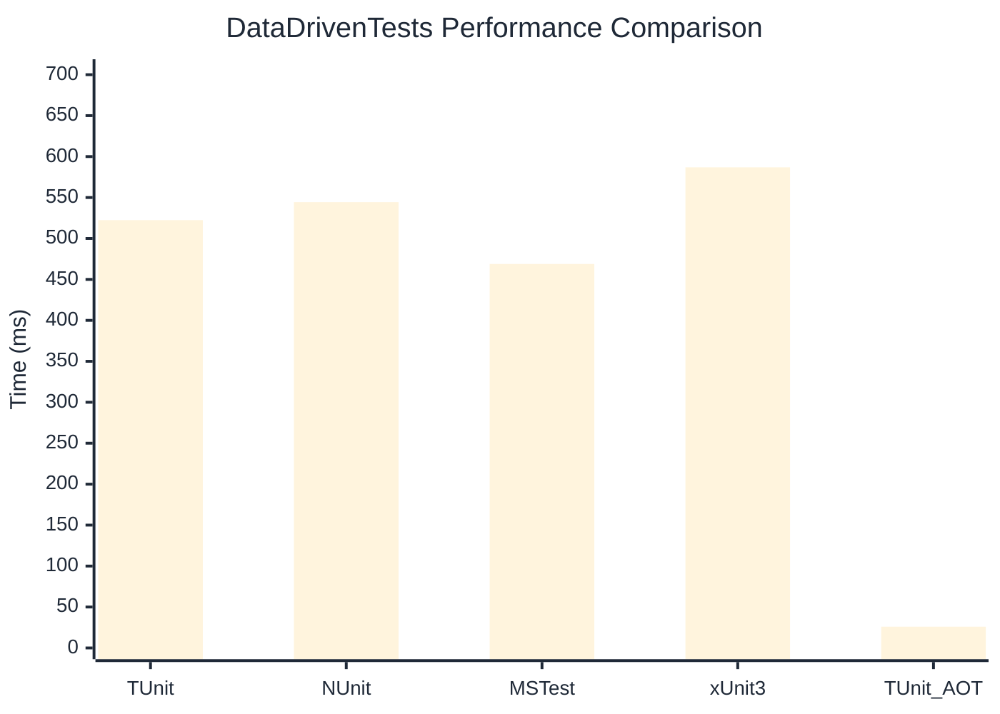

# DataDrivenTests Benchmark

:::info Last Updated
This benchmark was automatically generated on **2026-03-10** from the latest CI run.

**Environment:** Ubuntu Latest • .NET SDK 10.0.103
:::

## 📊 Results

| Framework | Version | Mean | Median | StdDev |
|-----------|---------|------|--------|--------|
| **TUnit** | 1.19.16 | 522.39 ms | 520.59 ms | 7.497 ms |
| NUnit | 4.5.1 | 544.31 ms | 542.99 ms | 5.880 ms |
| MSTest | 4.1.0 | 468.87 ms | 469.93 ms | 6.601 ms |
| xUnit3 | 3.2.2 | 586.86 ms | 584.18 ms | 7.443 ms |
| **TUnit (AOT)** | 1.19.16 | 25.96 ms | 25.95 ms | 0.106 ms |

## 📈 Visual Comparison

## 🎯 Key Insights

This benchmark compares TUnit's performance against NUnit, MSTest, xUnit3 using identical test scenarios.

---

:::note Methodology
View the [benchmarks overview](/docs/benchmarks) for methodology details and environment information.
:::

*Last generated: 2026-03-10T00:33:09.170Z*
