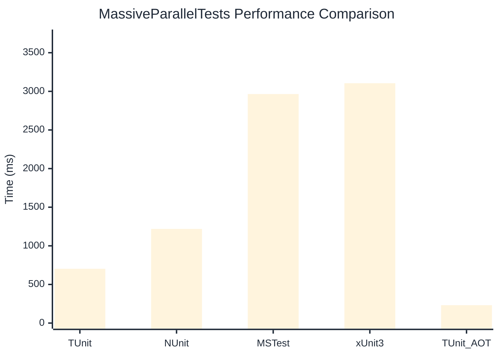

# MassiveParallelTests Benchmark

:::info Last Updated
This benchmark was automatically generated on **2026-03-06** from the latest CI run.

**Environment:** Ubuntu Latest • .NET SDK 10.0.103
:::

## 📊 Results

| Framework | Version | Mean | Median | StdDev |
|-----------|---------|------|--------|--------|
| **TUnit** | 1.18.21 | 702.7 ms | 702.3 ms | 3.95 ms |
| NUnit | 4.5.0 | 1,219.4 ms | 1,217.6 ms | 9.75 ms |
| MSTest | 4.1.0 | 2,964.9 ms | 2,965.7 ms | 5.32 ms |
| xUnit3 | 3.2.2 | 3,105.4 ms | 3,103.0 ms | 10.46 ms |
| **TUnit (AOT)** | 1.18.21 | 231.5 ms | 231.4 ms | 0.59 ms |

## 📈 Visual Comparison

## 🎯 Key Insights

This benchmark compares TUnit's performance against NUnit, MSTest, xUnit3 using identical test scenarios.

---

:::note Methodology
View the [benchmarks overview](/docs/benchmarks) for methodology details and environment information.
:::

*Last generated: 2026-03-06T00:40:48.922Z*
