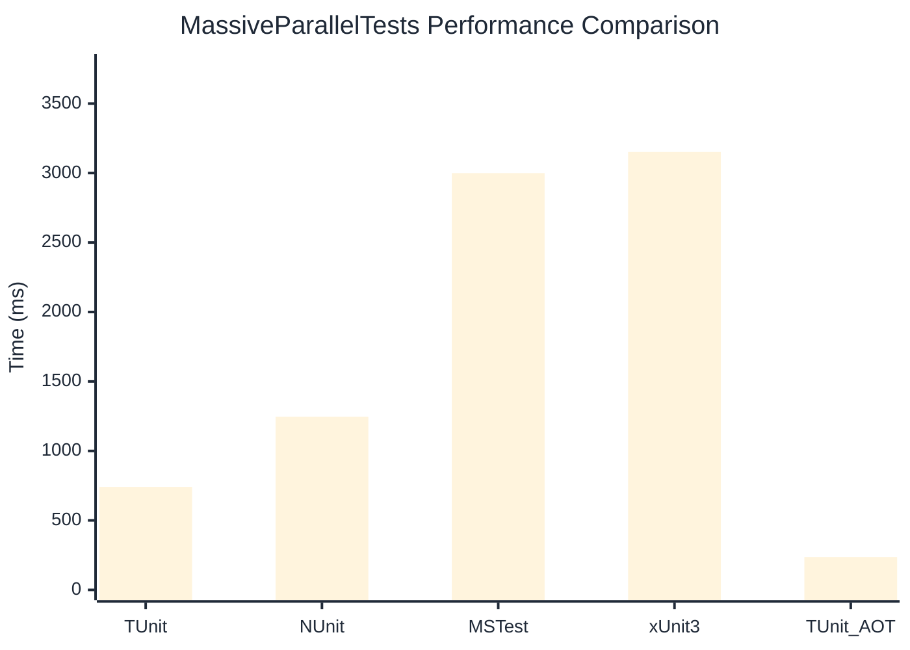

# MassiveParallelTests Benchmark

:::info Last Updated
This benchmark was automatically generated on **2026-03-09** from the latest CI run.

**Environment:** Ubuntu Latest • .NET SDK 10.0.103
:::

## 📊 Results

| Framework | Version | Mean | Median | StdDev |
|-----------|---------|------|--------|--------|
| **TUnit** | 1.19.11 | 741.3 ms | 742.3 ms | 10.35 ms |
| NUnit | 4.5.1 | 1,246.6 ms | 1,243.0 ms | 11.20 ms |
| MSTest | 4.1.0 | 2,999.7 ms | 3,000.5 ms | 6.63 ms |
| xUnit3 | 3.2.2 | 3,151.7 ms | 3,151.5 ms | 8.05 ms |
| **TUnit (AOT)** | 1.19.11 | 235.6 ms | 235.4 ms | 1.15 ms |

## 📈 Visual Comparison

## 🎯 Key Insights

This benchmark compares TUnit's performance against NUnit, MSTest, xUnit3 using identical test scenarios.

---

:::note Methodology
View the [benchmarks overview](/docs/benchmarks) for methodology details and environment information.
:::

*Last generated: 2026-03-09T00:36:33.796Z*
