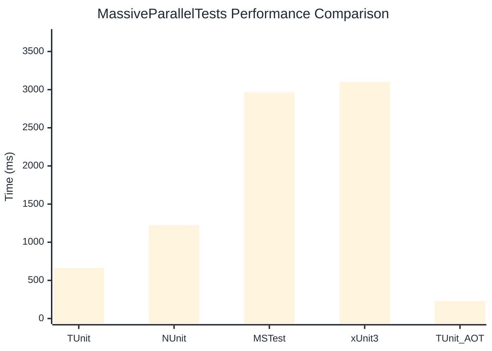

# MassiveParallelTests Benchmark

:::info Last Updated
This benchmark was automatically generated on **2026-04-06** from the latest CI run.

**Environment:** Ubuntu Latest • .NET SDK 10.0.201
:::

## 📊 Results

| Framework | Version | Mean | Median | StdDev |
|-----------|---------|------|--------|--------|
| **TUnit** | 1.28.7 | 664.1 ms | 665.1 ms | 4.80 ms |
| NUnit | 4.5.1 | 1,223.8 ms | 1,220.8 ms | 11.01 ms |
| MSTest | 4.1.0 | 2,964.9 ms | 2,962.8 ms | 12.12 ms |
| xUnit3 | 3.2.2 | 3,099.4 ms | 3,101.2 ms | 10.35 ms |
| **TUnit (AOT)** | 1.28.7 | 229.0 ms | 229.1 ms | 0.49 ms |

## 📈 Visual Comparison

## 🎯 Key Insights

This benchmark compares TUnit's performance against NUnit, MSTest, xUnit3 using identical test scenarios.

---

:::note Methodology
View the [benchmarks overview](/docs/benchmarks) for methodology details and environment information.
:::

*Last generated: 2026-04-06T00:41:40.887Z*
