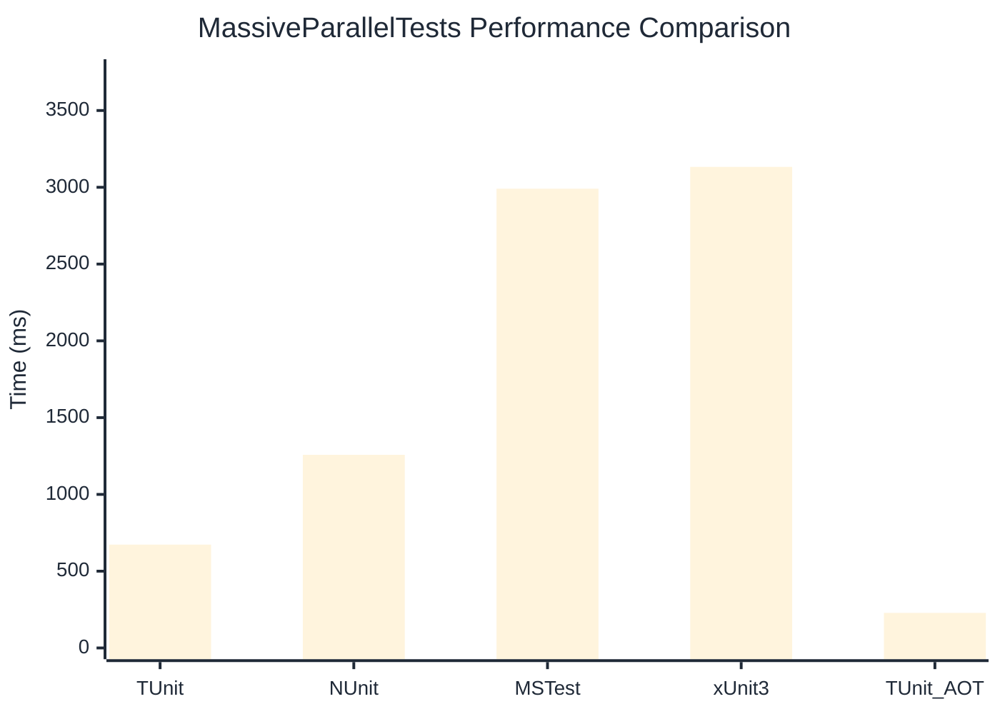

# MassiveParallelTests Benchmark

:::info Last Updated
This benchmark was automatically generated on **2026-04-05** from the latest CI run.

**Environment:** Ubuntu Latest • .NET SDK 10.0.201
:::

## 📊 Results

| Framework | Version | Mean | Median | StdDev |
|-----------|---------|------|--------|--------|
| **TUnit** | 1.27.0 | 673.0 ms | 672.4 ms | 2.56 ms |
| NUnit | 4.5.1 | 1,257.8 ms | 1,256.3 ms | 7.94 ms |
| MSTest | 4.1.0 | 2,990.7 ms | 2,991.4 ms | 2.72 ms |
| xUnit3 | 3.2.2 | 3,132.9 ms | 3,132.6 ms | 8.07 ms |
| **TUnit (AOT)** | 1.27.0 | 228.5 ms | 228.6 ms | 0.25 ms |

## 📈 Visual Comparison

## 🎯 Key Insights

This benchmark compares TUnit's performance against NUnit, MSTest, xUnit3 using identical test scenarios.

---

:::note Methodology
View the [benchmarks overview](/docs/benchmarks) for methodology details and environment information.
:::

*Last generated: 2026-04-05T00:42:23.772Z*
