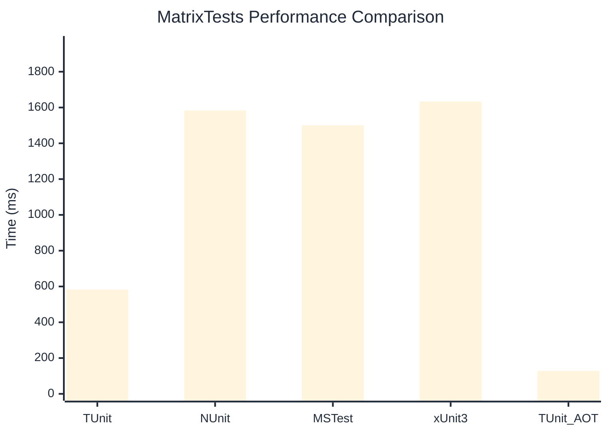

# MatrixTests Benchmark

:::info Last Updated
This benchmark was automatically generated on **2026-03-01** from the latest CI run.

**Environment:** Ubuntu Latest • .NET SDK 10.0.103
:::

## 📊 Results

| Framework | Version | Mean | Median | StdDev |
|-----------|---------|------|--------|--------|
| **TUnit** | 1.17.54 | 582.6 ms | 582.0 ms | 3.75 ms |
| NUnit | 4.5.0 | 1,584.0 ms | 1,584.9 ms | 8.98 ms |
| MSTest | 4.1.0 | 1,500.9 ms | 1,501.1 ms | 4.40 ms |
| xUnit3 | 3.2.2 | 1,633.5 ms | 1,632.8 ms | 4.54 ms |
| **TUnit (AOT)** | 1.17.54 | 128.0 ms | 128.1 ms | 0.50 ms |

## 📈 Visual Comparison

## 🎯 Key Insights

This benchmark compares TUnit's performance against NUnit, MSTest, xUnit3 using identical test scenarios.

---

:::note Methodology
View the [benchmarks overview](/docs/benchmarks) for methodology details and environment information.
:::

*Last generated: 2026-03-01T00:39:31.021Z*
