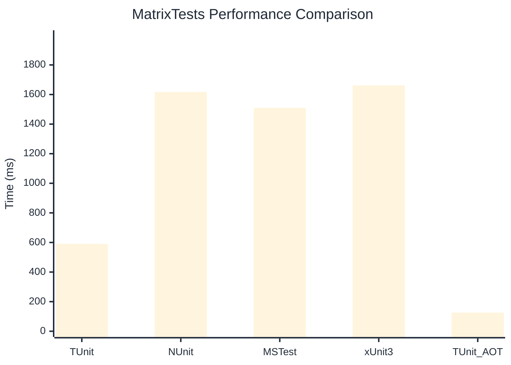

# MatrixTests Benchmark

:::info Last Updated
This benchmark was automatically generated on **2026-04-16** from the latest CI run.

**Environment:** Ubuntu Latest • .NET SDK 10.0.202
:::

## 📊 Results

| Framework | Version | Mean | Median | StdDev |
|-----------|---------|------|--------|--------|
| **TUnit** | 1.34.5 | 590.5 ms | 590.4 ms | 2.70 ms |
| NUnit | 4.5.1 | 1,616.7 ms | 1,617.1 ms | 5.89 ms |
| MSTest | 4.2.1 | 1,509.9 ms | 1,509.0 ms | 4.30 ms |
| xUnit3 | 3.2.2 | 1,661.7 ms | 1,661.2 ms | 6.20 ms |
| **TUnit (AOT)** | 1.34.5 | 126.0 ms | 125.9 ms | 0.45 ms |

## 📈 Visual Comparison

```mermaid
%%{init: {
  'theme':'base',
  'themeVariables': {
    'primaryColor': '#2563eb',
    'primaryTextColor': '#1f2937',
    'primaryBorderColor': '#1e40af',
    'lineColor': '#6b7280',
    'secondaryColor': '#7c3aed',
    'tertiaryColor': '#dc2626',
    'background': '#ffffff',
    'mainBkg': '#2563eb',
    'secondBkg': '#7c3aed',
    'tertiaryBkg': '#dc2626',
    'clusterBkg': '#f3f4f6',
    'edgeLabelBackground': '#ffffff',
    'tertiaryTextColor': '#1f2937',
    'pie1': '#2563eb',
    'pie2': '#7c3aed',
    'pie3': '#dc2626',
    'pie4': '#f59e0b',
    'pie5': '#10b981',
    'pie6': '#06b6d4',
    'pie7': '#ec4899',
    'pie8': '#6366f1',
    'pie9': '#84cc16',
    'pie10': '#f97316',
    'pie11': '#14b8a6',
    'pie12': '#a855f7'
  }
}}%%
xychart-beta
  title "MatrixTests Performance Comparison"
  x-axis ["TUnit", "NUnit", "MSTest", "xUnit3", "TUnit_AOT"]
  y-axis "Time (ms)" 0 --> 1995
  bar [590.5, 1616.7, 1509.9, 1661.7, 126]
```

## 🎯 Key Insights

This benchmark compares TUnit's performance against NUnit, MSTest, xUnit3 using identical test scenarios.

---

:::note Methodology
View the [benchmarks overview](/docs/benchmarks) for methodology details and environment information.
:::

*Last generated: 2026-04-16T00:46:53.077Z*
