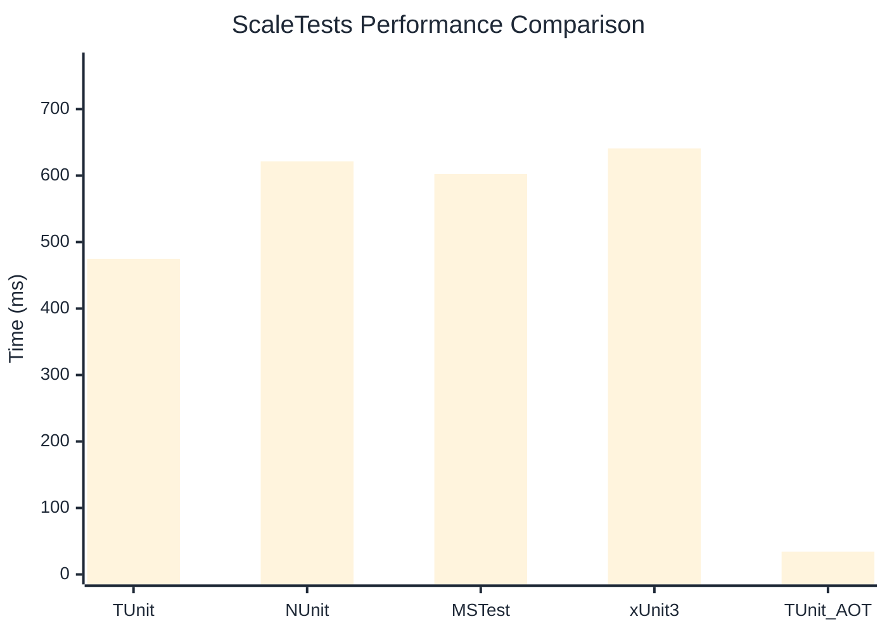

# ScaleTests Benchmark

:::info Last Updated
This benchmark was automatically generated on **2026-03-02** from the latest CI run.

**Environment:** Ubuntu Latest • .NET SDK 10.0.103
:::

## 📊 Results

| Framework | Version | Mean | Median | StdDev |
|-----------|---------|------|--------|--------|
| **TUnit** | 1.17.54 | 474.79 ms | 475.75 ms | 3.106 ms |
| NUnit | 4.5.0 | 621.37 ms | 616.55 ms | 10.757 ms |
| MSTest | 4.1.0 | 602.34 ms | 603.83 ms | 7.394 ms |
| xUnit3 | 3.2.2 | 640.87 ms | 641.13 ms | 5.159 ms |
| **TUnit (AOT)** | 1.17.54 | 34.20 ms | 34.01 ms | 2.674 ms |

## 📈 Visual Comparison

## 🎯 Key Insights

This benchmark compares TUnit's performance against NUnit, MSTest, xUnit3 using identical test scenarios.

---

:::note Methodology
View the [benchmarks overview](/docs/benchmarks) for methodology details and environment information.
:::

*Last generated: 2026-03-02T09:18:26.355Z*
