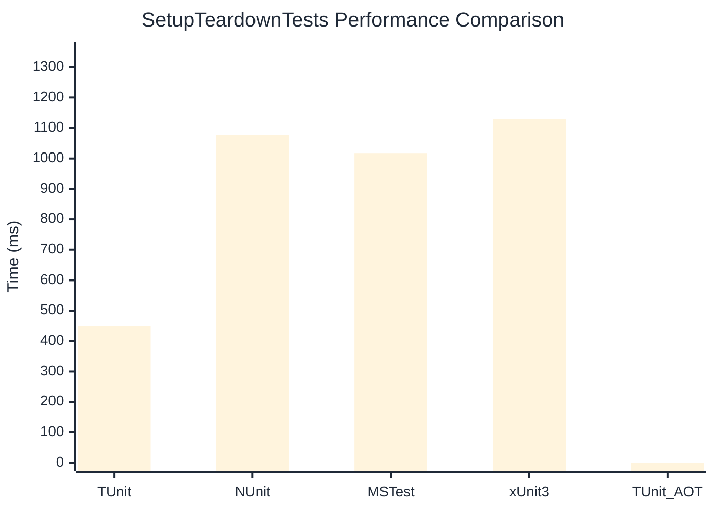

# SetupTeardownTests Benchmark

:::info Last Updated
This benchmark was automatically generated on **2026-05-14** from the latest CI run.

**Environment:** Ubuntu Latest • .NET SDK 10.0.300
:::

## 📊 Results

| Framework | Version | Mean | Median | StdDev |
|-----------|---------|------|--------|--------|
| **TUnit** | 1.44.0 | 449.3 ms | 450.1 ms | 2.32 ms |
| NUnit | 4.6.0 | 1,077.3 ms | 1,077.7 ms | 4.68 ms |
| MSTest | 4.2.2 | 1,017.6 ms | 1,015.6 ms | 5.75 ms |
| xUnit3 | 3.2.2 | 1,128.8 ms | 1,129.9 ms | 6.35 ms |
| **TUnit (AOT)** | 1.44.0 | NA | NA | NA |

## 📈 Visual Comparison

## 🎯 Key Insights

This benchmark compares TUnit's performance against NUnit, MSTest, xUnit3 using identical test scenarios.

---

:::note Methodology
View the [benchmarks overview](/docs/benchmarks) for methodology details and environment information.
:::

*Last generated: 2026-05-14T00:56:35.322Z*
