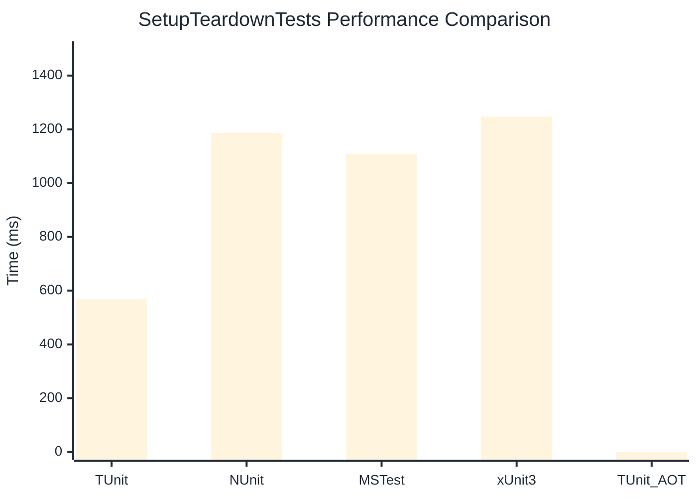

# SetupTeardownTests Benchmark

:::info Last Updated
This benchmark was automatically generated on **2026-04-21** from the latest CI run.

**Environment:** Ubuntu Latest • .NET SDK 10.0.202
:::

## 📊 Results

| Framework | Version | Mean | Median | StdDev |
|-----------|---------|------|--------|--------|
| **TUnit** | 1.37.10 | 567.4 ms | 566.4 ms | 6.91 ms |
| NUnit | 4.5.1 | 1,186.4 ms | 1,188.4 ms | 8.36 ms |
| MSTest | 4.2.1 | 1,107.8 ms | 1,108.1 ms | 14.20 ms |
| xUnit3 | 3.2.2 | 1,247.9 ms | 1,248.2 ms | 12.75 ms |
| **TUnit (AOT)** | 1.37.10 | NA | NA | NA |

## 📈 Visual Comparison

## 🎯 Key Insights

This benchmark compares TUnit's performance against NUnit, MSTest, xUnit3 using identical test scenarios.

---

:::note Methodology
View the [benchmarks overview](/docs/benchmarks) for methodology details and environment information.
:::

*Last generated: 2026-04-21T00:46:15.219Z*
