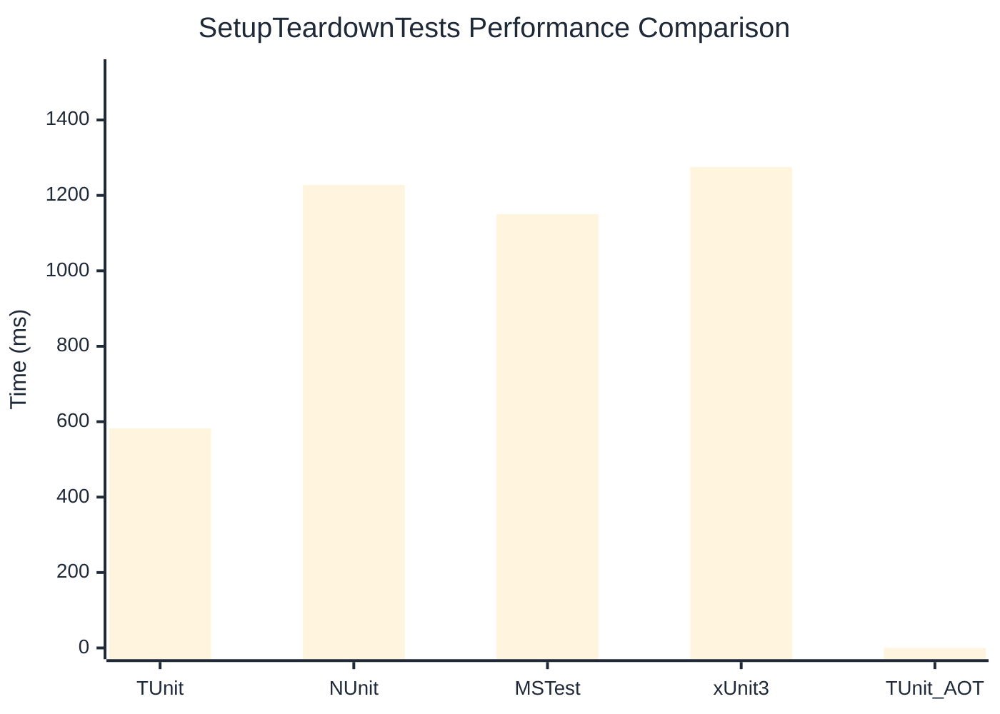

# SetupTeardownTests Benchmark

:::info Last Updated
This benchmark was automatically generated on **2026-04-07** from the latest CI run.

**Environment:** Ubuntu Latest • .NET SDK 10.0.201
:::

## 📊 Results

| Framework | Version | Mean | Median | StdDev |
|-----------|---------|------|--------|--------|
| **TUnit** | 1.28.7 | 582.0 ms | 579.9 ms | 5.86 ms |
| NUnit | 4.5.1 | 1,227.8 ms | 1,224.4 ms | 12.92 ms |
| MSTest | 4.1.0 | 1,150.4 ms | 1,149.8 ms | 7.80 ms |
| xUnit3 | 3.2.2 | 1,275.3 ms | 1,276.5 ms | 5.95 ms |
| **TUnit (AOT)** | 1.28.7 | NA | NA | NA |

## 📈 Visual Comparison

## 🎯 Key Insights

This benchmark compares TUnit's performance against NUnit, MSTest, xUnit3 using identical test scenarios.

---

:::note Methodology
View the [benchmarks overview](/docs/benchmarks) for methodology details and environment information.
:::

*Last generated: 2026-04-07T00:41:20.832Z*
