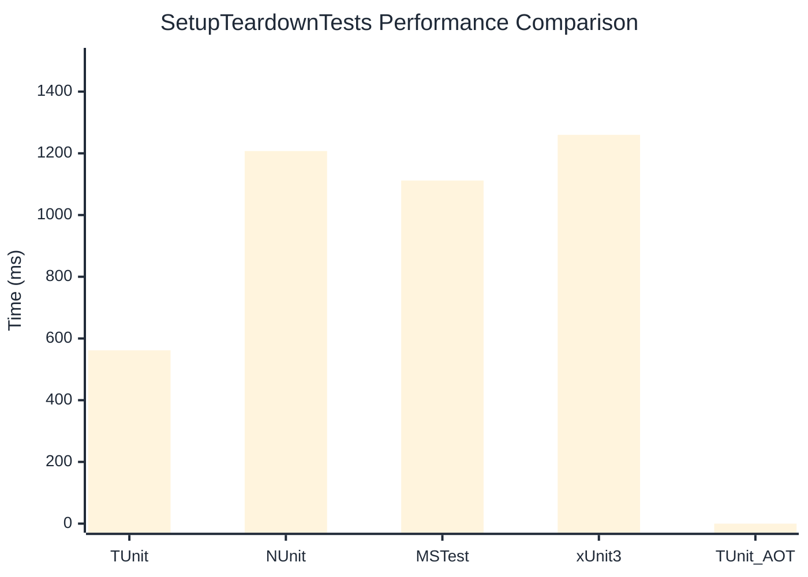

# SetupTeardownTests Benchmark

:::info Last Updated
This benchmark was automatically generated on **2026-05-15** from the latest CI run.

**Environment:** Ubuntu Latest • .NET SDK 10.0.300
:::

## 📊 Results

| Framework | Version | Mean | Median | StdDev |
|-----------|---------|------|--------|--------|
| **TUnit** | 1.44.39 | 561.6 ms | 561.1 ms | 4.68 ms |
| NUnit | 4.6.0 | 1,207.4 ms | 1,208.7 ms | 11.02 ms |
| MSTest | 4.2.3 | 1,111.9 ms | 1,109.4 ms | 8.66 ms |
| xUnit3 | 3.2.2 | 1,259.9 ms | 1,259.7 ms | 7.20 ms |
| **TUnit (AOT)** | 1.44.39 | NA | NA | NA |

## 📈 Visual Comparison

## 🎯 Key Insights

This benchmark compares TUnit's performance against NUnit, MSTest, xUnit3 using identical test scenarios.

---

:::note Methodology
View the [benchmarks overview](/docs/benchmarks) for methodology details and environment information.
:::

*Last generated: 2026-05-15T00:53:11.805Z*
