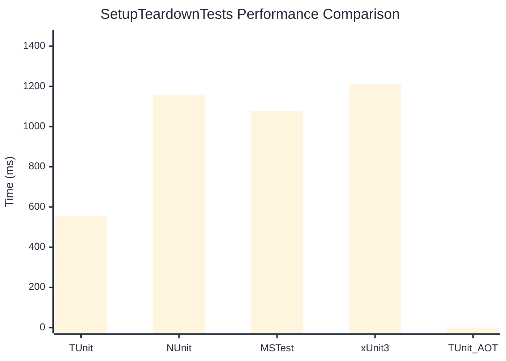

# SetupTeardownTests Benchmark

:::info Last Updated
This benchmark was automatically generated on **2026-05-27** from the latest CI run.

**Environment:** Ubuntu Latest • .NET SDK 10.0.300
:::

## 📊 Results

| Framework | Version | Mean | Median | StdDev |
|-----------|---------|------|--------|--------|
| **TUnit** | 1.45.29 | 554.1 ms | 553.9 ms | 2.91 ms |
| NUnit | 4.6.1 | 1,158.2 ms | 1,158.5 ms | 7.46 ms |
| MSTest | 4.2.3 | 1,077.2 ms | 1,078.2 ms | 6.68 ms |
| xUnit3 | 3.2.2 | 1,209.4 ms | 1,207.8 ms | 4.70 ms |
| **TUnit (AOT)** | 1.45.29 | NA | NA | NA |

## 📈 Visual Comparison

## 🎯 Key Insights

This benchmark compares TUnit's performance against NUnit, MSTest, xUnit3 using identical test scenarios.

---

:::note Methodology
View the [benchmarks overview](/docs/benchmarks) for methodology details and environment information.
:::

*Last generated: 2026-05-27T00:58:02.780Z*
