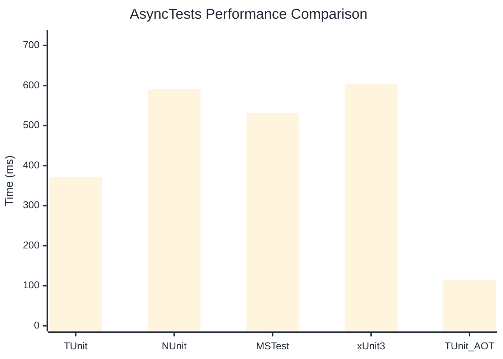

# AsyncTests Benchmark

> Realistic async/await patterns with I/O simulation

:::info Last Updated
This benchmark was automatically generated on **2026-06-21** from the latest CI run.

**Environment:** Ubuntu Latest • .NET SDK 10.0.301
:::

## 📊 Results

| Framework | Version | Mean | Median | StdDev |
|-----------|---------|------|--------|--------|
| **TUnit** | 1.56.18 | 370.7 ms | 368.9 ms | 4.92 ms |
| NUnit | 4.6.1 | 590.8 ms | 589.5 ms | 7.84 ms |
| MSTest | 4.2.3 | 531.8 ms | 532.0 ms | 6.74 ms |
| xUnit3 | 3.2.2 | 603.6 ms | 603.1 ms | 5.26 ms |
| **TUnit (AOT)** | 1.56.18 | 115.1 ms | 115.2 ms | 0.16 ms |

## 📈 Visual Comparison

## 🎯 Key Insights

This benchmark compares TUnit's performance against NUnit, MSTest, xUnit3 using identical test scenarios.

---

:::note Methodology
View the [benchmarks overview](/docs/benchmarks) for methodology details and environment information.
:::

*Last generated: 2026-06-21T00:53:41.571Z*
