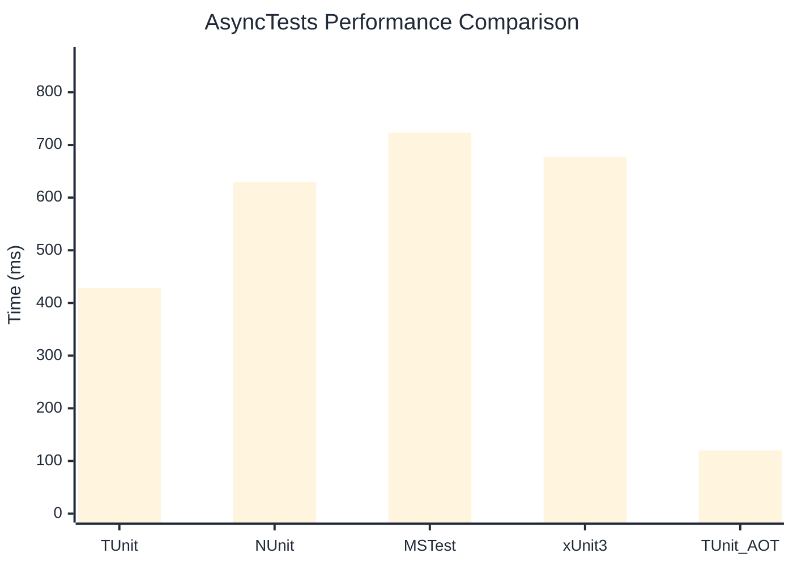

# AsyncTests Benchmark

> Realistic async/await patterns with I/O simulation

:::info Last Updated
This benchmark was automatically generated on **2026-07-21** from the latest CI run.

**Environment:** Ubuntu Latest • .NET SDK 10.0.302
:::

## 📊 Results

| Framework | Version | Mean | Median | StdDev |
|-----------|---------|------|--------|--------|
| **TUnit** | 1.61.23 | 428.1 ms | 422.9 ms | 38.65 ms |
| NUnit | 4.6.1 | 629.2 ms | 623.0 ms | 27.83 ms |
| MSTest | 4.3.2 | 723.4 ms | 725.1 ms | 22.17 ms |
| xUnit3 | 3.2.2 | 677.8 ms | 672.7 ms | 28.69 ms |
| **TUnit (AOT)** | 1.61.23 | 120.0 ms | 120.2 ms | 0.82 ms |

## 📈 Visual Comparison

## 🎯 Key Insights

This benchmark compares TUnit's performance against NUnit, MSTest, xUnit3 using identical test scenarios.

---

:::note Methodology
View the [benchmarks overview](/docs/benchmarks) for methodology details and environment information.
:::

*Last generated: 2026-07-21T23:54:21.482Z*
