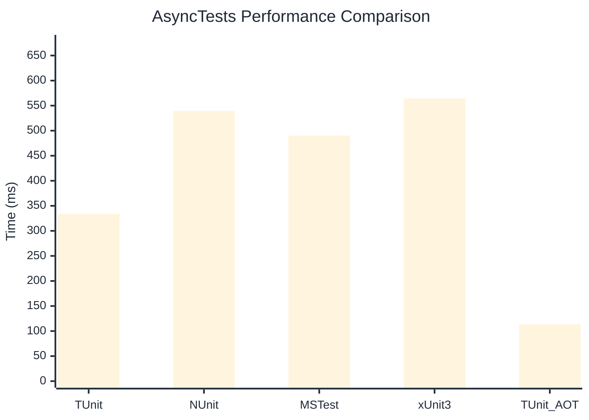

# AsyncTests Benchmark

> Realistic async/await patterns with I/O simulation

:::info Last Updated
This benchmark was automatically generated on **2026-06-07** from the latest CI run.

**Environment:** Ubuntu Latest • .NET SDK 10.0.300
:::

## 📊 Results

| Framework | Version | Mean | Median | StdDev |
|-----------|---------|------|--------|--------|
| **TUnit** | 1.50.0 | 333.5 ms | 331.0 ms | 6.78 ms |
| NUnit | 4.6.1 | 539.6 ms | 540.0 ms | 2.69 ms |
| MSTest | 4.2.3 | 490.2 ms | 489.7 ms | 1.65 ms |
| xUnit3 | 3.2.2 | 564.4 ms | 564.4 ms | 3.46 ms |
| **TUnit (AOT)** | 1.50.0 | 113.5 ms | 113.4 ms | 0.83 ms |

## 📈 Visual Comparison

## 🎯 Key Insights

This benchmark compares TUnit's performance against NUnit, MSTest, xUnit3 using identical test scenarios.

---

:::note Methodology
View the [benchmarks overview](/docs/benchmarks) for methodology details and environment information.
:::

*Last generated: 2026-06-07T00:51:01.520Z*
