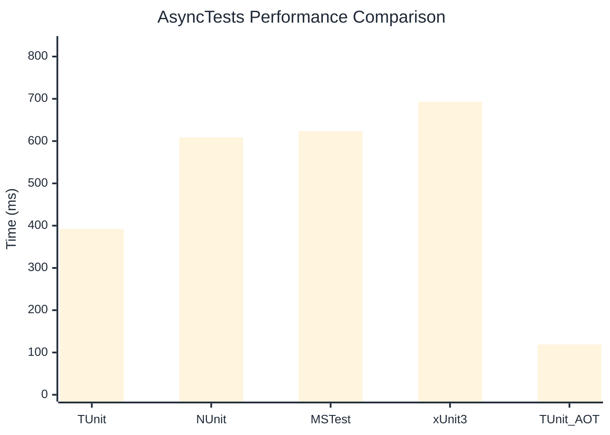

# AsyncTests Benchmark

> Realistic async/await patterns with I/O simulation

:::info Last Updated
This benchmark was automatically generated on **2026-06-29** from the latest CI run.

**Environment:** Ubuntu Latest • .NET SDK 10.0.301
:::

## 📊 Results

| Framework | Version | Mean | Median | StdDev |
|-----------|---------|------|--------|--------|
| **TUnit** | 1.57.0 | 392.6 ms | 376.6 ms | 36.23 ms |
| NUnit | 4.6.1 | 608.5 ms | 606.5 ms | 16.89 ms |
| MSTest | 4.2.3 | 623.8 ms | 620.3 ms | 42.18 ms |
| xUnit3 | 3.2.2 | 693.1 ms | 684.8 ms | 45.31 ms |
| **TUnit (AOT)** | 1.57.0 | 119.1 ms | 117.2 ms | 3.38 ms |

## 📈 Visual Comparison

## 🎯 Key Insights

This benchmark compares TUnit's performance against NUnit, MSTest, xUnit3 using identical test scenarios.

---

:::note Methodology
View the [benchmarks overview](/docs/benchmarks) for methodology details and environment information.
:::

*Last generated: 2026-06-29T09:11:59.772Z*
