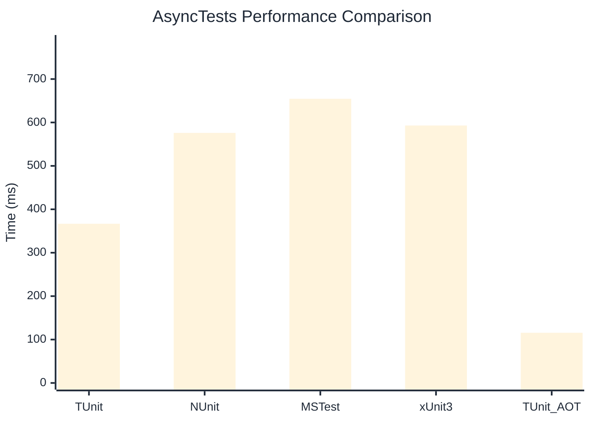

# AsyncTests Benchmark

> Realistic async/await patterns with I/O simulation

:::info Last Updated
This benchmark was automatically generated on **2026-07-19** from the latest CI run.

**Environment:** Ubuntu Latest • .NET SDK 10.0.302
:::

## 📊 Results

| Framework | Version | Mean | Median | StdDev |
|-----------|---------|------|--------|--------|
| **TUnit** | 1.61.0 | 366.7 ms | 366.5 ms | 1.33 ms |
| NUnit | 4.6.1 | 576.0 ms | 575.5 ms | 6.86 ms |
| MSTest | 4.3.2 | 654.5 ms | 653.0 ms | 8.79 ms |
| xUnit3 | 3.2.2 | 593.0 ms | 594.9 ms | 7.87 ms |
| **TUnit (AOT)** | 1.61.0 | 115.6 ms | 115.7 ms | 0.19 ms |

## 📈 Visual Comparison

## 🎯 Key Insights

This benchmark compares TUnit's performance against NUnit, MSTest, xUnit3 using identical test scenarios.

---

:::note Methodology
View the [benchmarks overview](/docs/benchmarks) for methodology details and environment information.
:::

*Last generated: 2026-07-19T00:36:15.197Z*
