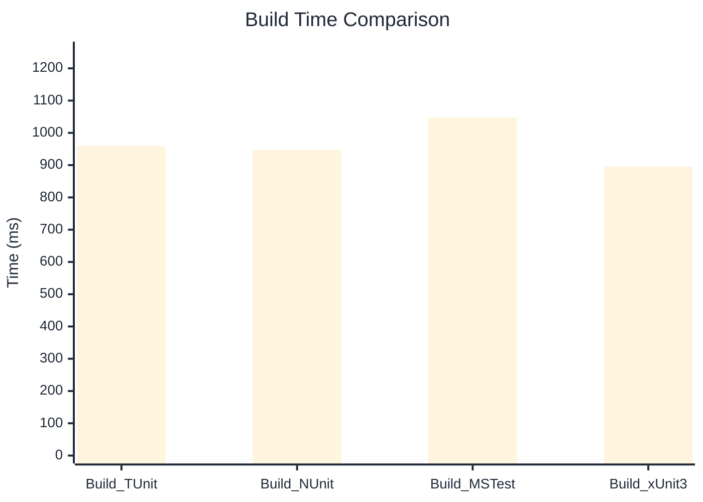

# Build Performance Benchmark

> Compilation time from a clean build across frameworks — how long it takes to build an identical test project.

:::info Last Updated
This benchmark was automatically generated on **2026-06-21** from the latest CI run.

**Environment:** Ubuntu Latest • .NET SDK 10.0.301
:::

## 📊 Results

Compilation time comparison across frameworks:

| Framework | Version | Mean | Median | StdDev |
|-----------|---------|------|--------|--------|
| **TUnit** | 1.56.18 | 959.6 ms | 954.8 ms | 16.36 ms |
| Build_NUnit | 4.6.1 | 946.9 ms | 939.9 ms | 17.64 ms |
| Build_MSTest | 4.2.3 | 1,048.0 ms | 1,049.6 ms | 52.40 ms |
| Build_xUnit3 | 3.2.2 | 895.6 ms | 893.5 ms | 6.42 ms |

## 📈 Visual Comparison

---

:::note Methodology
View the [benchmarks overview](/docs/benchmarks) for methodology details and environment information.
:::

*Last generated: 2026-06-21T00:53:41.573Z*
