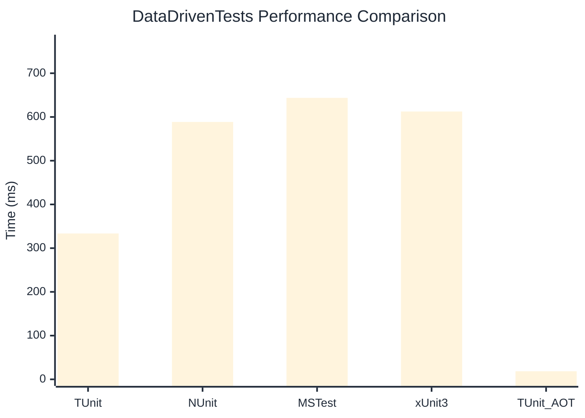

# DataDrivenTests Benchmark

> Parameterized tests with multiple data sources

:::info Last Updated
This benchmark was automatically generated on **2026-07-16** from the latest CI run.

**Environment:** Ubuntu Latest • .NET SDK 10.0.302
:::

## 📊 Results

| Framework | Version | Mean | Median | StdDev |
|-----------|---------|------|--------|--------|
| **TUnit** | 1.60.0 | 333.55 ms | 329.63 ms | 26.217 ms |
| NUnit | 4.6.1 | 588.63 ms | 588.62 ms | 30.349 ms |
| MSTest | 4.3.2 | 643.67 ms | 644.95 ms | 34.220 ms |
| xUnit3 | 3.2.2 | 612.50 ms | 613.31 ms | 23.558 ms |
| **TUnit (AOT)** | 1.60.0 | 18.46 ms | 18.50 ms | 1.089 ms |

## 📈 Visual Comparison

## 🎯 Key Insights

This benchmark compares TUnit's performance against NUnit, MSTest, xUnit3 using identical test scenarios.

---

:::note Methodology
View the [benchmarks overview](/docs/benchmarks) for methodology details and environment information.
:::

*Last generated: 2026-07-16T16:49:09.140Z*
