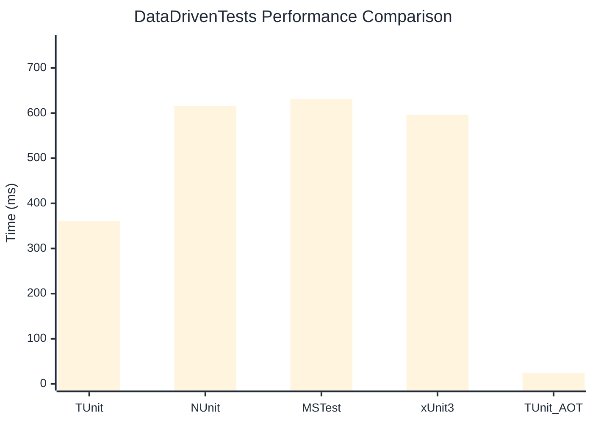

# DataDrivenTests Benchmark

> Parameterized tests with multiple data sources

:::info Last Updated
This benchmark was automatically generated on **2026-06-29** from the latest CI run.

**Environment:** Ubuntu Latest • .NET SDK 10.0.301
:::

## 📊 Results

| Framework | Version | Mean | Median | StdDev |
|-----------|---------|------|--------|--------|
| **TUnit** | 1.57.0 | 360.26 ms | 354.05 ms | 33.918 ms |
| NUnit | 4.6.1 | 615.55 ms | 613.26 ms | 32.345 ms |
| MSTest | 4.2.3 | 631.08 ms | 630.75 ms | 31.116 ms |
| xUnit3 | 3.2.2 | 596.48 ms | 592.61 ms | 38.008 ms |
| **TUnit (AOT)** | 1.57.0 | 24.64 ms | 24.60 ms | 2.501 ms |

## 📈 Visual Comparison

## 🎯 Key Insights

This benchmark compares TUnit's performance against NUnit, MSTest, xUnit3 using identical test scenarios.

---

:::note Methodology
View the [benchmarks overview](/docs/benchmarks) for methodology details and environment information.
:::

*Last generated: 2026-06-29T09:11:59.772Z*
