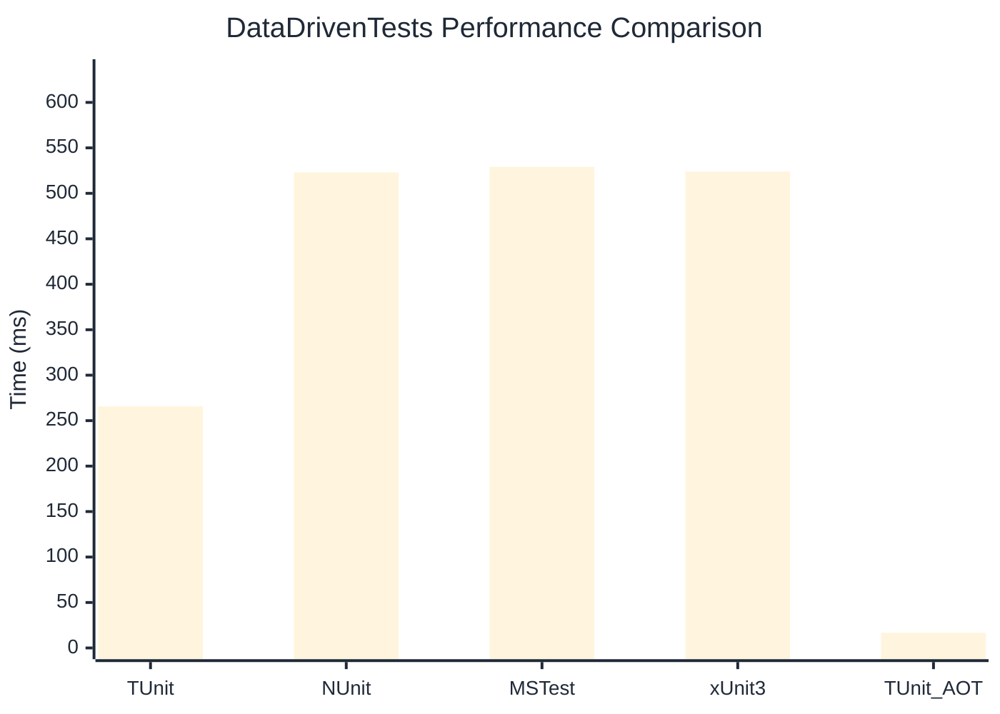

# DataDrivenTests Benchmark

> Parameterized tests with multiple data sources

:::info Last Updated
This benchmark was automatically generated on **2026-07-12** from the latest CI run.

**Environment:** Ubuntu Latest • .NET SDK 10.0.301
:::

## 📊 Results

| Framework | Version | Mean | Median | StdDev |
|-----------|---------|------|--------|--------|
| **TUnit** | 1.58.0 | 265.70 ms | 264.36 ms | 9.348 ms |
| NUnit | 4.6.1 | 523.01 ms | 519.57 ms | 14.061 ms |
| MSTest | 4.3.0 | 529.13 ms | 527.68 ms | 34.022 ms |
| xUnit3 | 3.2.2 | 523.90 ms | 517.07 ms | 24.917 ms |
| **TUnit (AOT)** | 1.58.0 | 16.65 ms | 16.68 ms | 1.655 ms |

## 📈 Visual Comparison

## 🎯 Key Insights

This benchmark compares TUnit's performance against NUnit, MSTest, xUnit3 using identical test scenarios.

---

:::note Methodology
View the [benchmarks overview](/docs/benchmarks) for methodology details and environment information.
:::

*Last generated: 2026-07-12T00:38:25.258Z*
