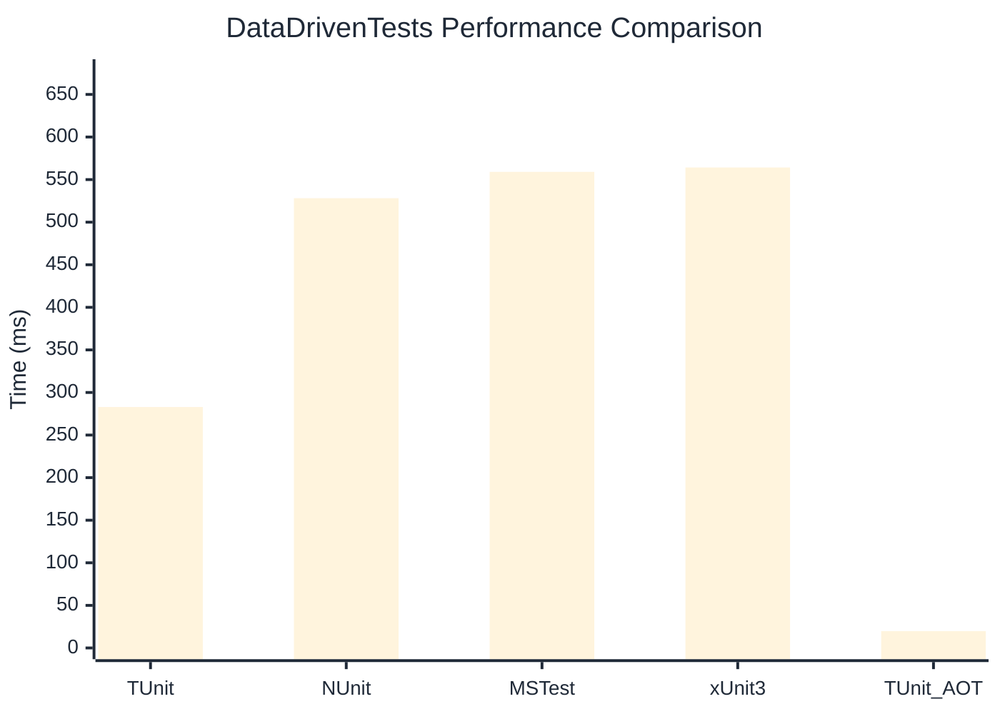

# DataDrivenTests Benchmark

> Parameterized tests with multiple data sources

:::info Last Updated
This benchmark was automatically generated on **2026-06-28** from the latest CI run.

**Environment:** Ubuntu Latest • .NET SDK 10.0.301
:::

## 📊 Results

| Framework | Version | Mean | Median | StdDev |
|-----------|---------|------|--------|--------|
| **TUnit** | 1.56.35 | 282.91 ms | 280.12 ms | 12.612 ms |
| NUnit | 4.6.1 | 528.15 ms | 524.49 ms | 21.578 ms |
| MSTest | 4.2.3 | 559.04 ms | 559.68 ms | 29.893 ms |
| xUnit3 | 3.2.2 | 564.20 ms | 559.19 ms | 32.521 ms |
| **TUnit (AOT)** | 1.56.35 | 19.80 ms | 19.71 ms | 2.559 ms |

## 📈 Visual Comparison

## 🎯 Key Insights

This benchmark compares TUnit's performance against NUnit, MSTest, xUnit3 using identical test scenarios.

---

:::note Methodology
View the [benchmarks overview](/docs/benchmarks) for methodology details and environment information.
:::

*Last generated: 2026-06-28T00:49:53.675Z*
